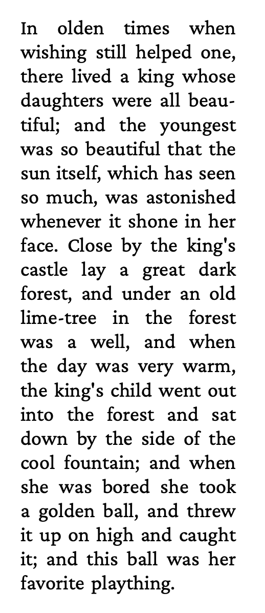
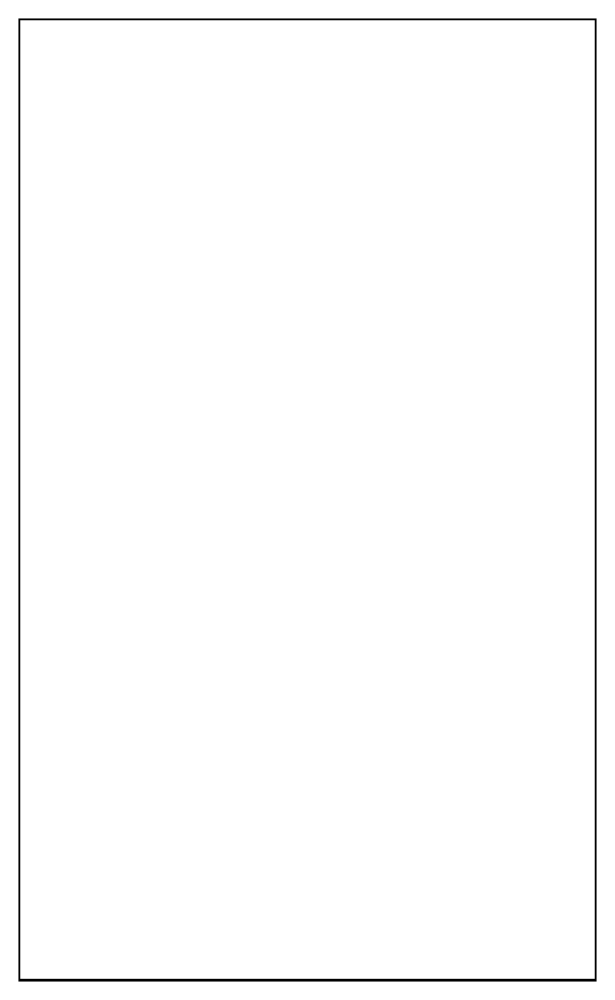
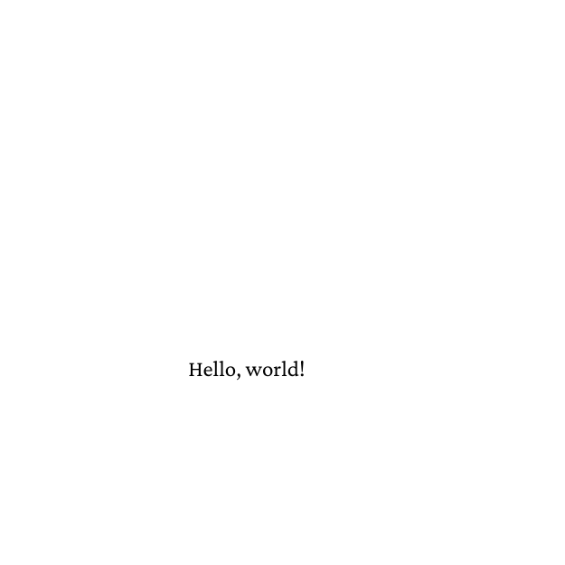
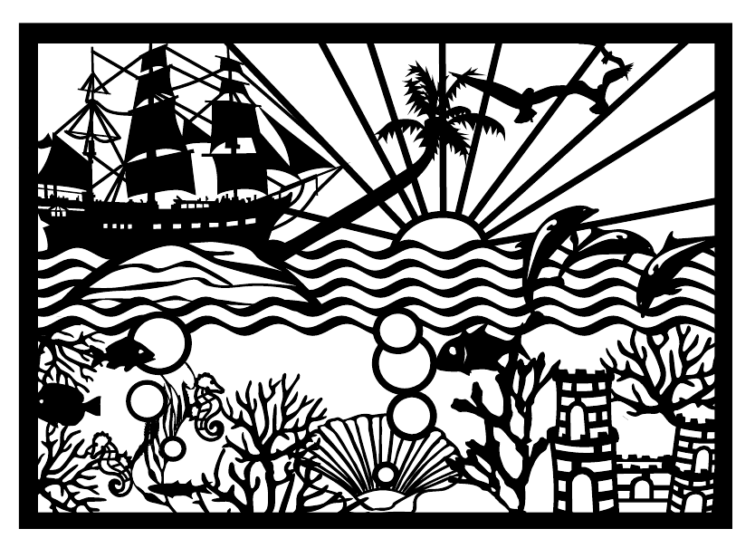
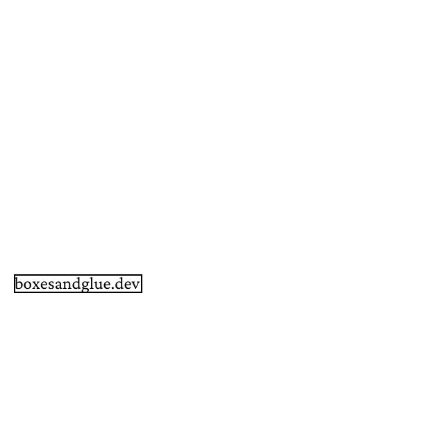
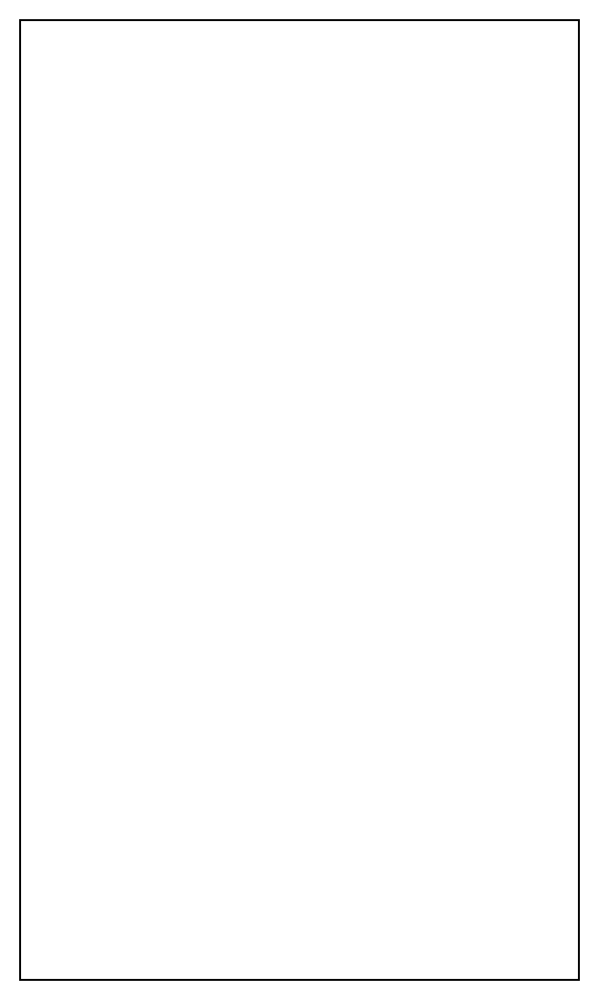

# boxes and glue — examples

Working examples for the [boxes and glue](https://boxesandglue.dev/)
PDF typesetting library: a Go port of TeX-style line breaking and
page layout, with high-level wrappers for HTML, Markdown, XSL-FO and
direct Lua scripting.

The examples are split by which layer of the stack they exercise:

* **[glu](glu)** — the scripting tool: HTML, Markdown, XSL-FO, Lua
* **[frontend](#frontend)** — the high-level Go API: paragraphs,
  tables, font families
* **[baseline](#baseline)** — the low-level PDF writer:
  pages, fonts, annotations, outlines, image embedding
* **[fonts](fonts)** — shared font assets used by several examples

Every example ships a runnable source file, a generated PDF, and (for
PDF-producing examples) a `firstpage.png` preview rendered with
`pdftoppm` at 150 dpi.

## glu

See [`glu/Readme.md`](glu) for the full thematic listing — HTML
floats, an XSL-FO walker, Markdown barcodes / slides, and direct Lua
bindings (text shaping, ZUGFeRD invoices).

Pick of the pack:

Description | Preview
--- | ---
[Floats / inserts](glu/html/floats) — top / bottom floats and footnotes via plain CSS | 
[XSL-FO walker](glu/xslfo) — XSL-FO front matter handed to htmlbag | 
[PDF/UA tagging](glu/xslfo/10-pdfua) — ISO 14289-1 accessibility | 
[Markdown slides](glu/markdown/slides) — 16:9 deck from Markdown | 
[Barcodes](glu/markdown/barcodes) — EAN-13, Code 128, QR via the `<barcode>` element | 
[ZUGFeRD invoice](glu/lua_interface/zugferdinvoice) — EN 16931 PDF/A-3 | 

## frontend

The high-level Go API — `frontend.Document`, font families, paragraph
formatting, tables. Run any example with `go run main.go` from inside
its directory.

Description | Preview
--- | ---
[Hello world](frontend/helloworld) — smallest end-to-end frontend program | 
[Simple table](frontend/simpletable) — row / column basics | 
[Table with cell spans](frontend/tablespan) — `colspan` / `rowspan` from XML | 

## baseline

The low-level `baseline-pdf` writer — direct PDF object construction,
no frontend layer, no paragraph builder. Useful for understanding
what the higher levels add (and for the rare case where you need to
emit PDF objects by hand). Run any example with `go run main.go`.

Description | Preview
--- | ---
[Simple PDF](baseline/simplepdf) — minimal two-page document | 
[Font](baseline/font) — load a font and write a glyph | 
[Image](baseline/image) — import a PDF as a Form XObject | 
[Annotation (hyperlink)](baseline/annotation) — clickable URI annotation | 
[Outline — direct destinations](baseline/outlinedirectdest) — bookmarks pointing at explicit `/XYZ` views | 
[Outline — named destinations](baseline/outlinenamedest) — bookmarks via the catalog `/Names` dictionary | 

## fonts

Shared font assets used by several examples (loaded via relative
paths from the example directory). Currently:

* `fonts/crimsonpro/` — Crimson Pro (SIL Open Font Licence 1.1) in
  Regular / Italic / Bold / BoldItalic.

## Documentation

* Library handbook: <https://doc.speedata.de/boxesandglue/>
* glu handbook: <https://boxesandglue.dev/glu/>
* htmlbag handbook: <https://doc.speedata.de/htmlbag/>
* hobby curve library: <https://boxesandglue.dev/hobby/>
