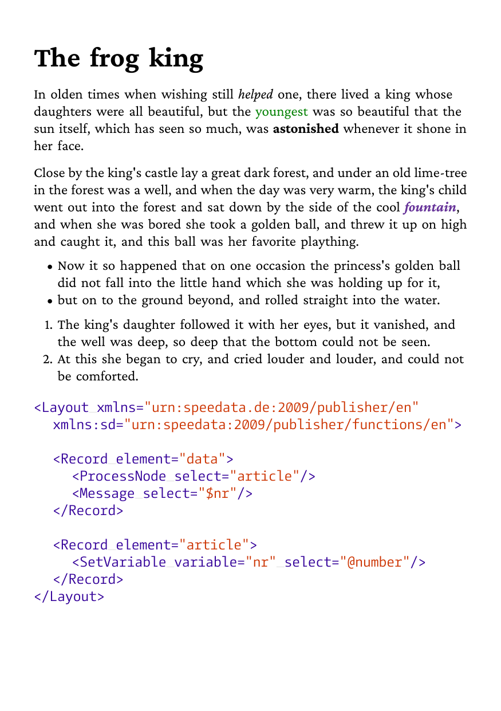
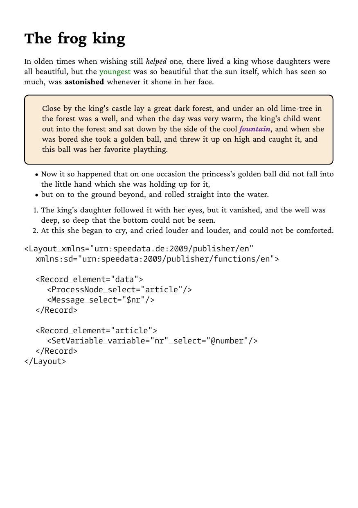
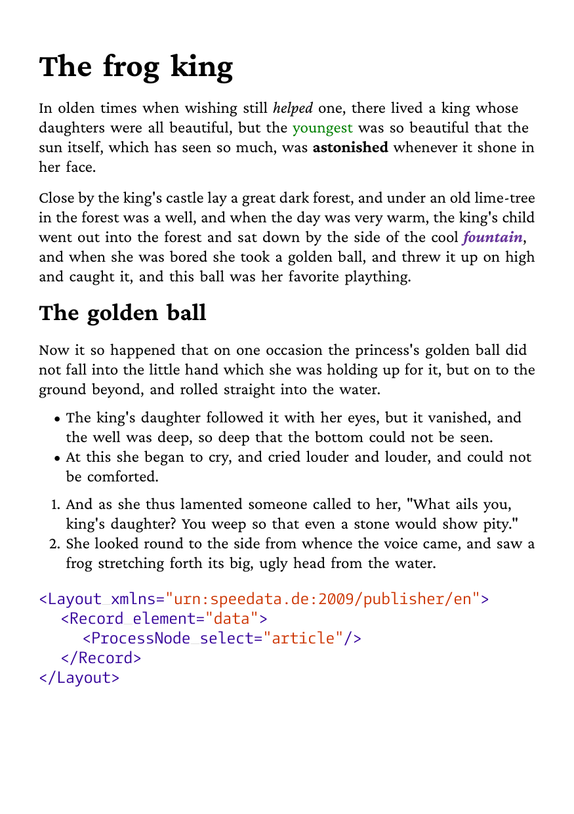
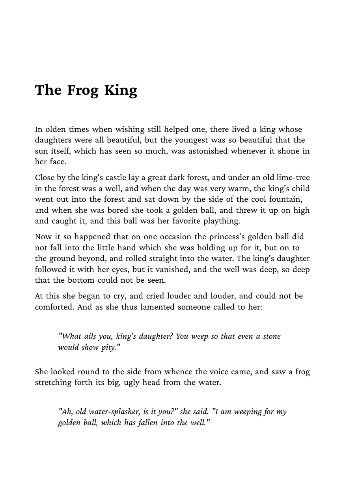
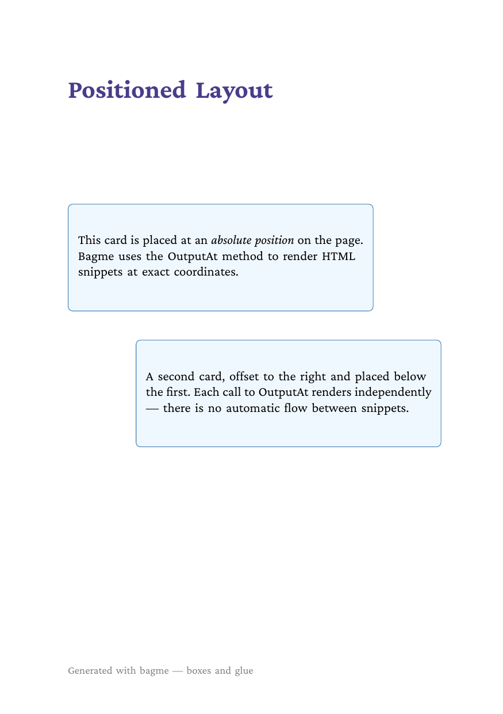
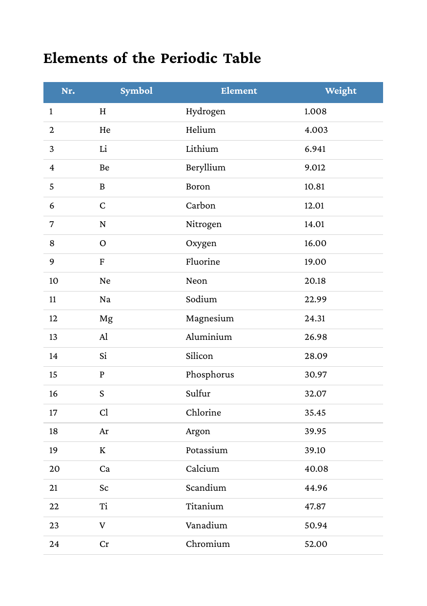

This repository contains ready-to-run examples for the [bagme](https://github.com/boxesandglue/bagme) library.

Example | Description | Preview
------- | ----------- | -------
[Simple](basic/simple) | Basic HTML rendering with CSS styling, lists and code blocks | 
[Border](basic/border) | Borders, border-radius and background colors on elements | 
[Accessible PDF](basic/accessible) | PDF/UA output with automatic structure tagging for screen readers | 
[Multipage](basic/multipage) | Automatic page breaks, forced breaks with `page-break-before` | 
[Positioned](basic/position) | Manual placement with `OutputAt` using absolute coordinates | 
[Table](basic/table) | Tables with repeating headers across page breaks | 
