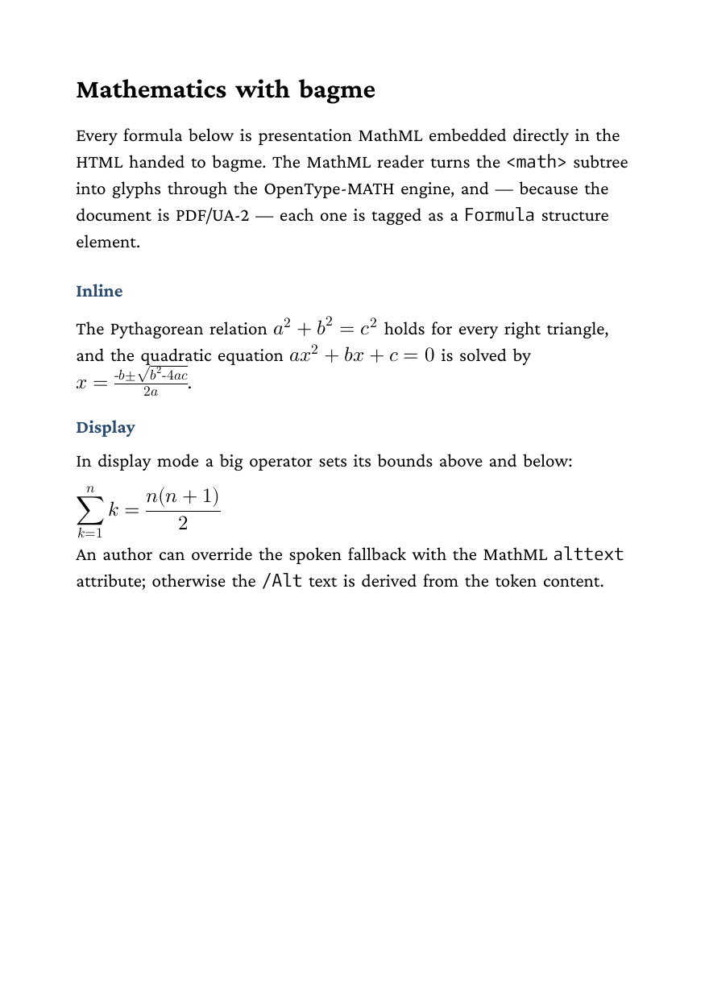

# Accessible mathematics (MathML → PDF/UA-2)

Inline and display MathML, typeset through the OpenType-MATH engine and
tagged as accessible `Formula` structure elements. To get the PDF, run

    go run main.go

from the command line.

The result looks like this:

## How it works

- `document.New("out.pdf", document.WithPDFUA2())` turns on PDF 2.0 +
  structure tagging — the single switch that makes every `<math>` an
  accessible `Formula` element.
- `styles.css` registers a math font via `@font-face` (the engine needs a
  font carrying an OpenType `MATH` table) and points the `math` selector at
  it.
- `content.html` holds plain presentation MathML; bagme hands it to
  htmlbag's MathML reader and the math engine.

Each formula becomes a `Formula` structure element with a plain-text `/Alt`
fallback and — under PDF/UA-2 — the MathML source embedded as an associated
file (`application/mathml+xml`, `/AFRelationship /Supplement`). Verify:

    pdfa11y out.pdf      # Verdict: PASS, incl. the MathML checks MH-17-*

See the [Mathematics (MathML)](https://boxesandglue.dev/htmlbag/mathml) and
[PDF/UA tagging](https://boxesandglue.dev/htmlbag/library/pdfua#mathematics-formula)
documentation for the supported elements and the accessibility details.
