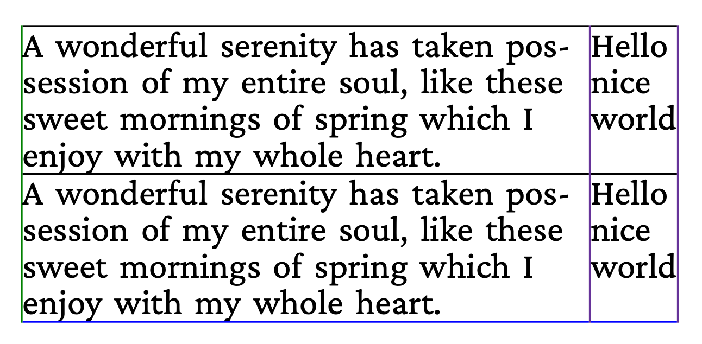

# Simple table

A basic table laid out with the `frontend` table builder. Demonstrates
column widths, row construction, and where the table API sits between
the paragraph builder and the page assembler.

## Run

```
go run main.go
```

Produces `result.pdf`.

## Result


