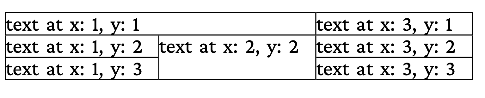

# Table with cell spans

Tables with `colspan` / `rowspan` cell merging. The frontend builds
the table from XML (`out.xml` is the input fixture); cells span both
horizontally and vertically.

## Run

```
go run main.go
```

Produces `result.pdf`.

## Result


