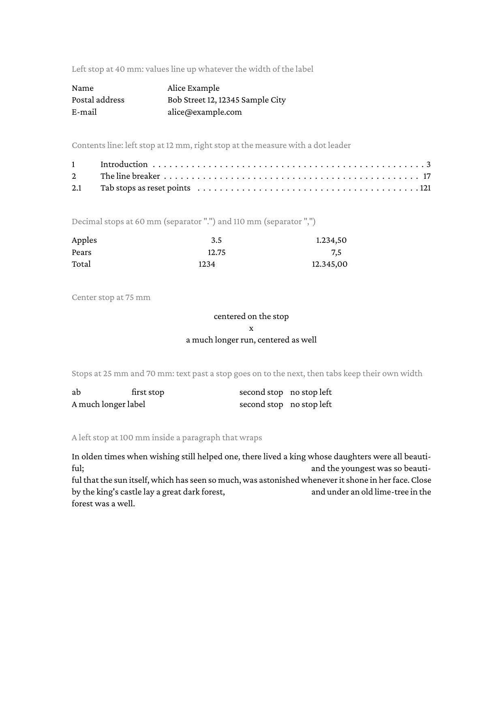

# Tab stops

Positioned tab stops for the `frontend` package: a paragraph gets a
list of stops with `SettingTabStops`, and every tab character in the
text advances to the next stop past the text before it. A stop is
left, right, center or decimal aligned and may carry a leader pattern.
The page shows a label/value list, a contents line with a dot leader,
decimal columns with "." and "," as separators, a center stop, stops
that run out, and a stop inside a paragraph that wraps.

The stops are resolved inside the line breaker, so a paragraph with
tabs breaks into lines with the widths the tabs actually get.

## Run

```
go run main.go
```

Produces `result.pdf`.

## Result


