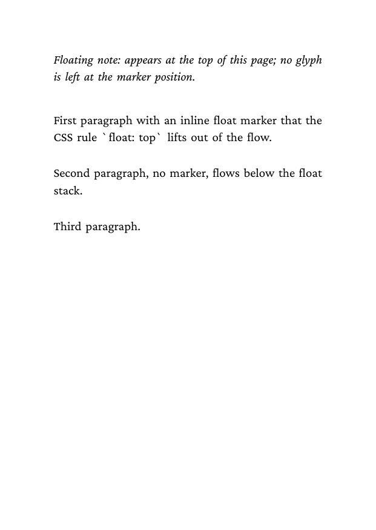
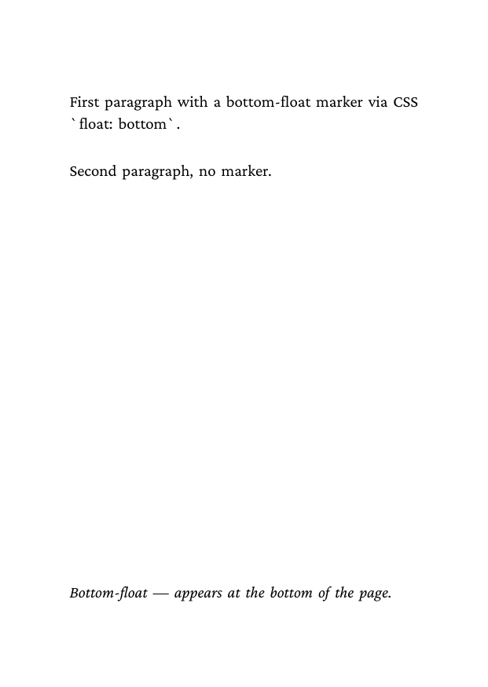
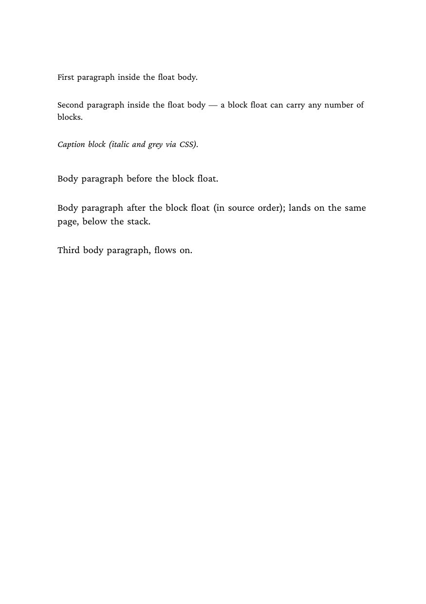
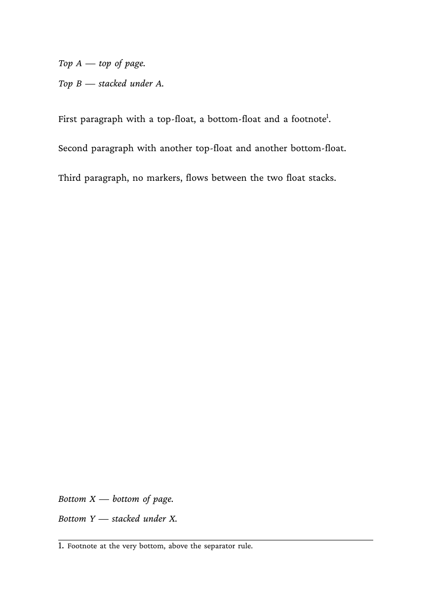
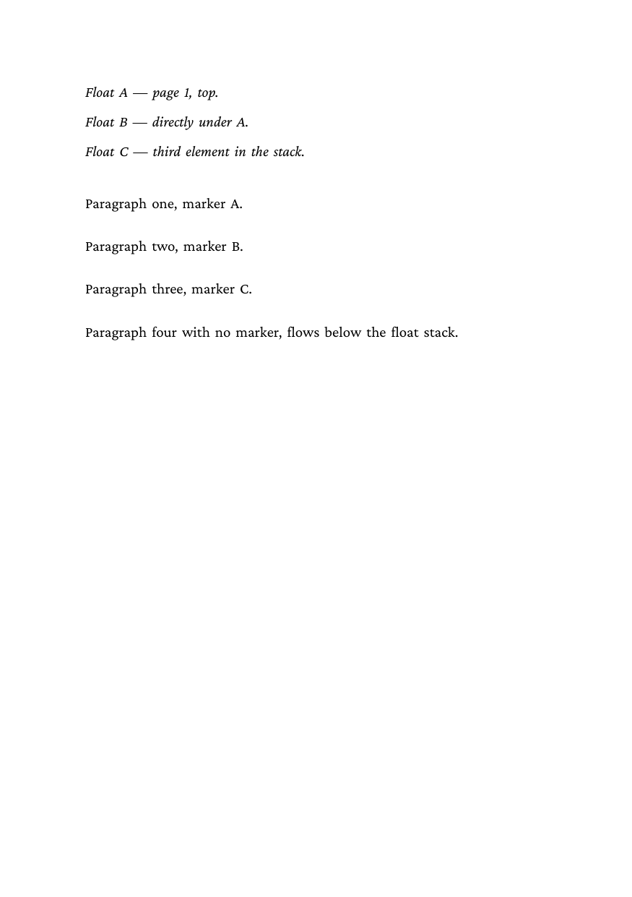
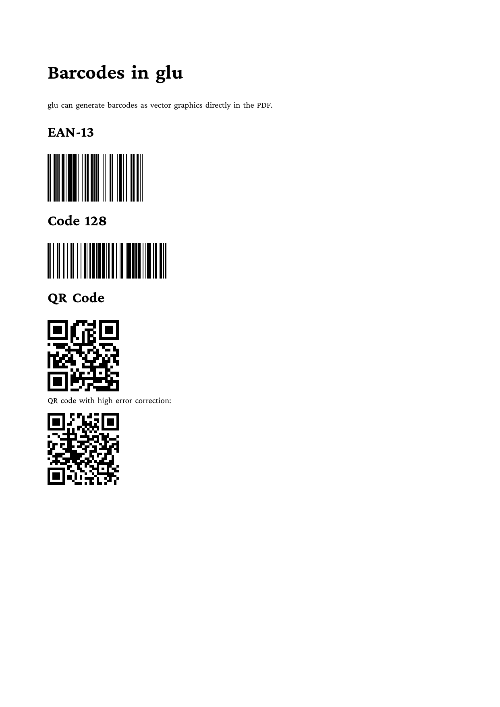
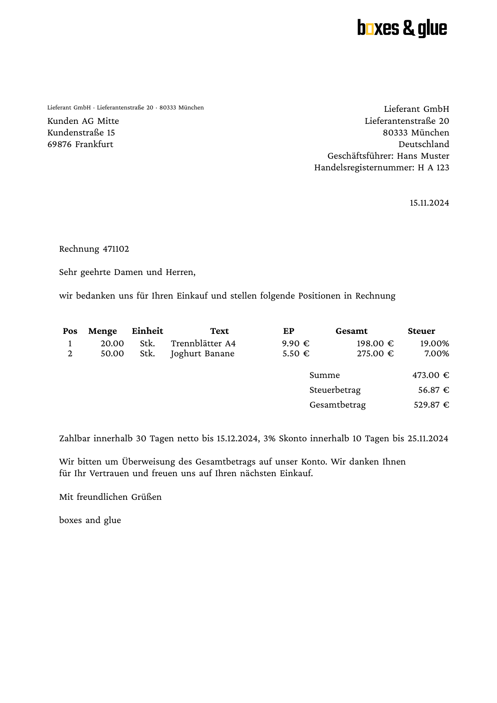

# glu examples

Examples for [glu](https://boxesandglue.dev/glu/) — the
boxesandglue-based scripting tool that drives Markdown, HTML and Lua
straight to PDF, with optional XSL-FO front matter via the bundled
walker. Every example below ships a runnable source file, a
generated `result.pdf`, and a `firstpage.png` preview.

## Table of contents

* [HTML / floats](#html--floats)
* [XSL-FO walker](#xsl-fo-walker)
* [Markdown](#markdown)
* [Lua interface](#lua-interface)

## HTML / floats

htmlbag's float and footnote insert system, driven from plain HTML.

Description | Preview
--- | ---
[01 — Inline top float](html/floats/01-inline-top) | <a href="html/floats/01-inline-top"></a>
[02 — Inline bottom float](html/floats/02-inline-bottom) | <a href="html/floats/02-inline-bottom"></a>
[03 — Block float, multiple paragraphs](html/floats/03-block-multi-paragraph) | <a href="html/floats/03-block-multi-paragraph"></a>
[04 — All four insert classes](html/floats/04-mixed-classes) | <a href="html/floats/04-mixed-classes"></a>
[05 — Three floats sharing one page](html/floats/05-three-floats-one-page) | <a href="html/floats/05-three-floats-one-page"></a>

See [`html/floats/Readme.md`](html/floats) for the float syntax,
footnote syntax, and page-painting order.

## XSL-FO walker

A proof-of-concept Lua script (`xslfo/foproc.lua`) that walks an
XSL-FO source, builds HTML in memory, and hands it to glu's HTML
pipeline.

Description | Preview
--- | ---
[01 — Basic walker](xslfo/01-basic) | <a href="xslfo/01-basic"></a>
[02 — Top float](xslfo/02-float-top) | <a href="xslfo/02-float-top"></a>
[03 — Bottom float](xslfo/03-float-bottom) | <a href="xslfo/03-float-bottom"></a>
[04 — All four insert classes](xslfo/04-float-mixed) | <a href="xslfo/04-float-mixed"></a>
[05 — Image in flow](xslfo/05-image) | <a href="xslfo/05-image"></a>
[06 — Image in a top float](xslfo/06-image-float) | <a href="xslfo/06-image-float"></a>
[07 — Arabic / RTL](xslfo/07-rtl-arabic) | <a href="xslfo/07-rtl-arabic"></a>
[08 — Mixed LTR / RTL](xslfo/08-mixed-ltr-rtl) | <a href="xslfo/08-mixed-ltr-rtl"></a>
[09 — Soft hyphens](xslfo/09-soft-hyphen) | <a href="xslfo/09-soft-hyphen"></a>
[10 — PDF/UA accessibility](xslfo/10-pdfua) | <a href="xslfo/10-pdfua"></a>

See [`xslfo/Readme.md`](xslfo) for the walker's coverage table and the
PDF/UA tagging pipeline.

## Markdown

glu's Markdown pipeline — YAML frontmatter, embedded Lua blocks
(`` ```{lua} ``), inline expressions `{= expr =}`, plus bespoke HTML
elements.

Description | Preview
--- | ---
[Barcodes](markdown/barcodes) — `<barcode>` element: EAN-13, Code 128, QR | <a href="markdown/barcodes"></a>
[Slides](markdown/slides) — Markdown → 16:9 slide deck with hobby-curve accents | <a href="markdown/slides"></a>

## Lua interface

Programmatic use of glu's Lua bindings — direct calls into the
frontend, font, and node APIs without the Markdown / HTML wrappers.

Description | Preview
--- | ---
[Text shaping](lua_interface/textshape) — `frontend.shape` glyph dump (console output, no PDF) | <code>glyph=362 cluster=0 …</code>
[ZUGFeRD invoice](lua_interface/zugferdinvoice) — EN 16931 PDF/A-3 with embedded CII XML | <a href="lua_interface/zugferdinvoice"></a>

## Installing glu

Pre-built binaries: <https://github.com/boxesandglue/glu/releases/latest>.

Homebrew (macOS / Linux):

```
brew install boxesandglue/tap/glu
```

Build from source (requires Go):

```
git clone https://github.com/boxesandglue/glu
cd glu
rake build
```

See <https://boxesandglue.dev/glu/> for full installation and usage
documentation.
