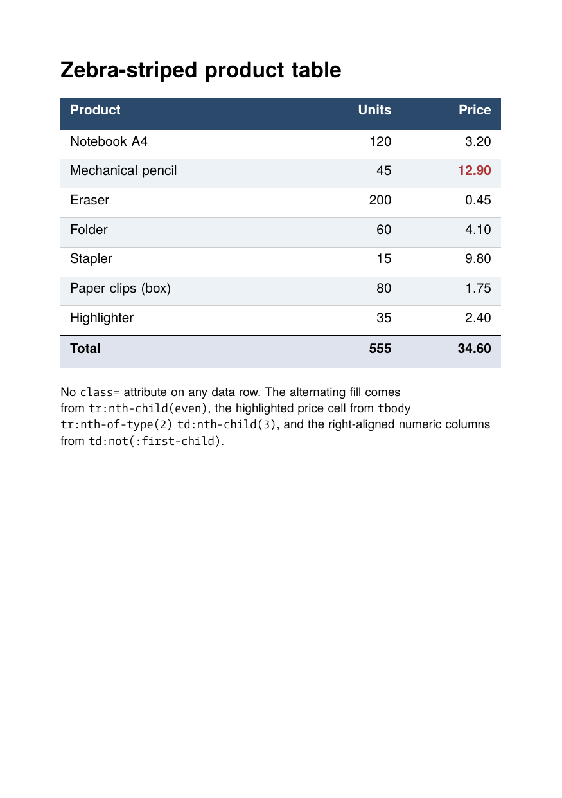
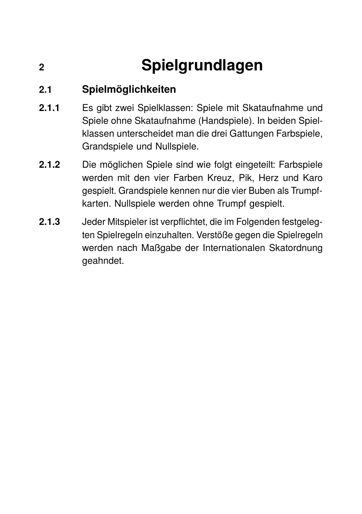
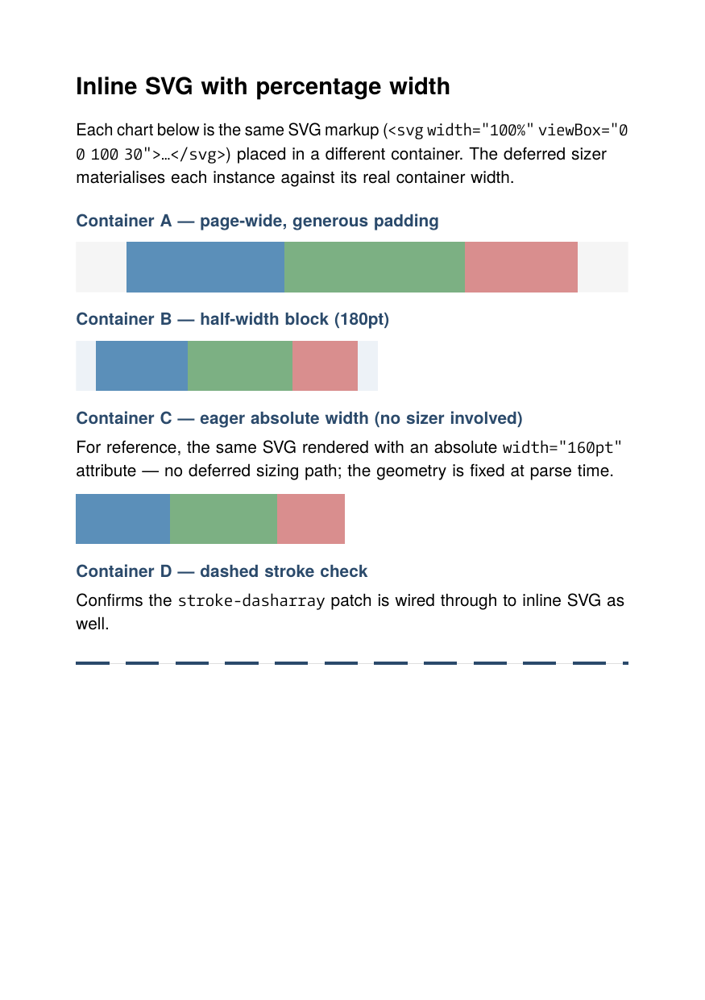
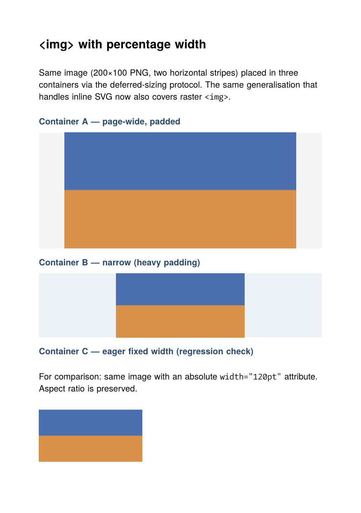
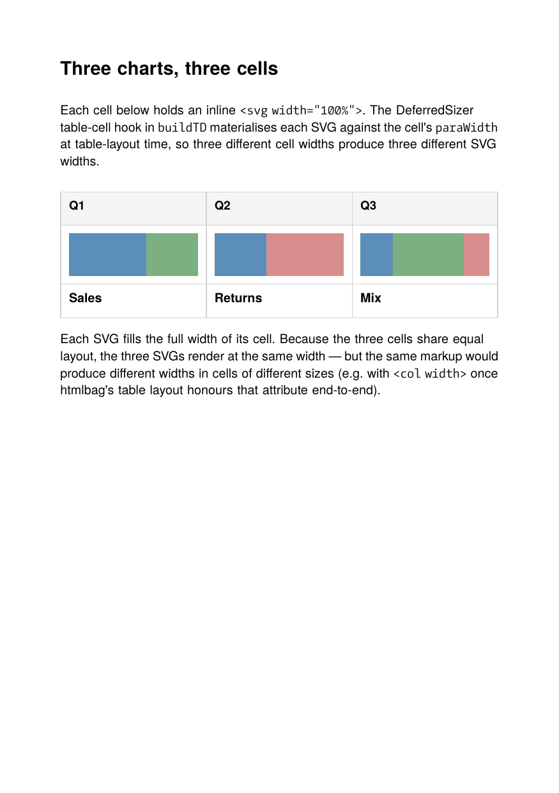
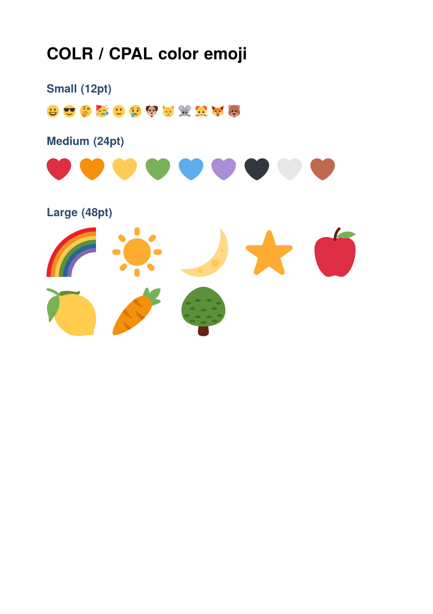
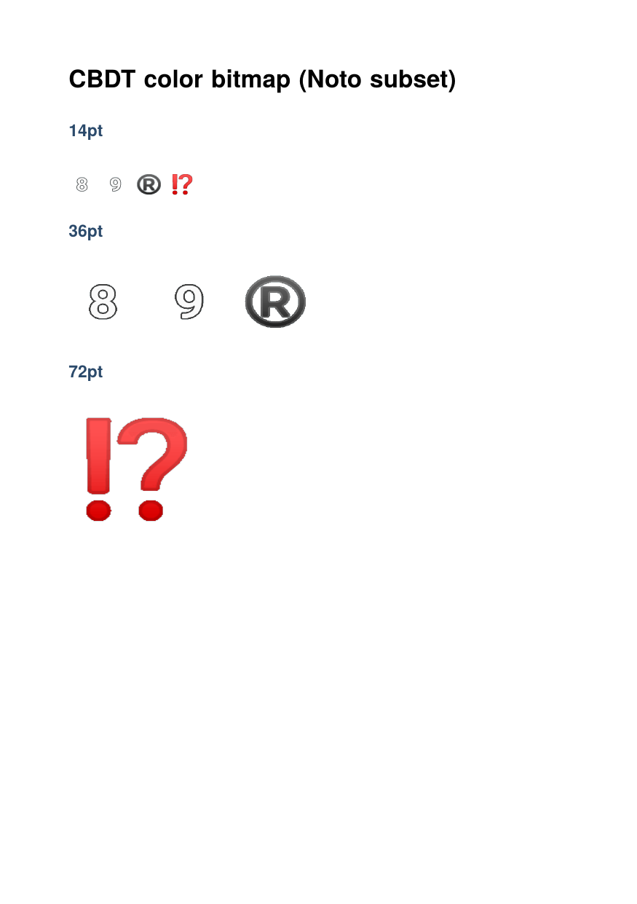
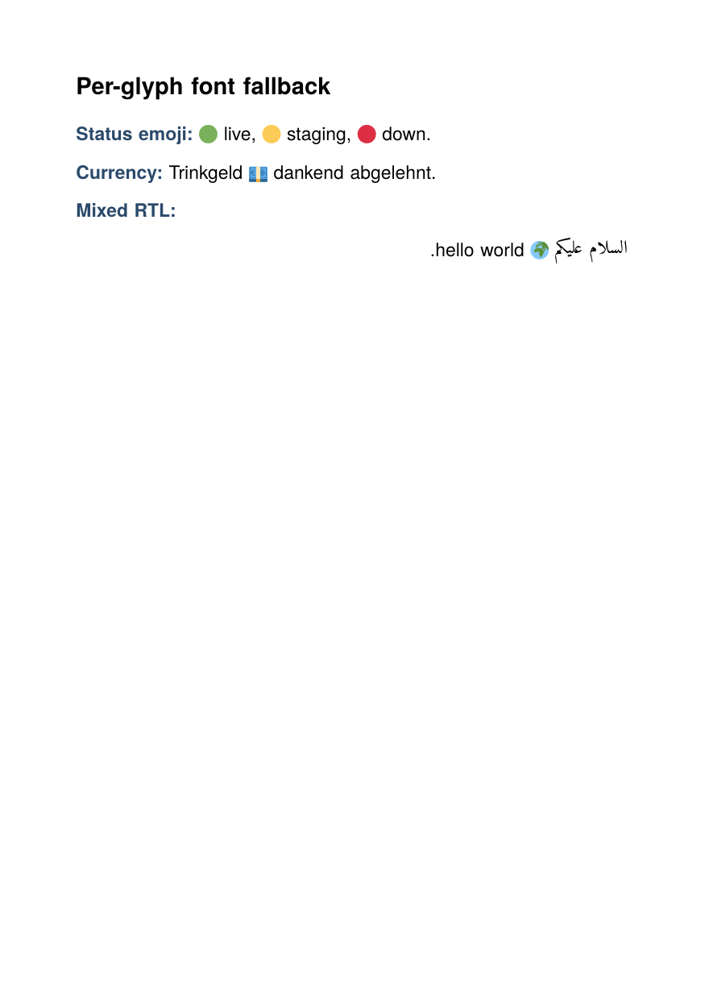

# HTML examples

Plain HTML / CSS driven through `htmlbag` — the boxesandglue HTML+CSS
layout engine. Each example ships a runnable source file, a
`result.pdf` and a `firstpage.png` preview next to the HTML.

## Standalone examples

Description | Preview
--- | ---
[Zebra-striped table](zebra-table) — CSS3 structural selectors: `:nth-child(even)`, `:nth-of-type(n)`, `:not(...)`, `:first-child`, `:last-child`, plus `<tfoot>` totals | <a href="zebra-table"></a>
[`::marker` pseudo](marker-pseudo) — CSS Pseudo 4 `li::marker { color, font-size, font-family, content }` with `counter()` content | <a href="marker-pseudo"></a>
[Numbered sections](numbered-sections) — Skatordnung-style nested numbered headings with hanging-indent markers (numbers hardcoded in HTML) | <a href="numbered-sections"></a>
[Numbered sections via CSS counters](numbered-sections-counters) — same layout, but numbers come from `counter-reset` / `counter-increment` / `counters()` | <a href="numbered-sections-counters"></a>
[Inline SVG with percentage width](inline-svg-percentage) — `<svg width="100%">` adapting to different containers via deferred sizing; includes a `stroke-dasharray` check | <a href="inline-svg-percentage"></a>
[`` with percentage width](img-percentage) — raster image equivalent of the deferred-sizing demo; aspect ratio preserved across container sizes | <a href="img-percentage"></a>
[Inline SVG in table cells](svg-in-table) — dashboard-style three-column table where each cell carries an `<svg width="100%">`, materialised against the cell's `paraWidth` | <a href="svg-in-table"></a>
[Inline image vertical-align](inline-image-align) — CSS `vertical-align: text-top` / `top` on raster `` inside a paragraph; image top aligns with the parent font's ascent | <a href="inline-image-align"></a>

## Color emoji and font fallback

Per-glyph color emoji rendering across the four OpenType color formats
(COLR/CPAL, CBDT, sbix, SVG-in-OT), plus the CSS Fonts 4 prioritised-list
fallback that lets a single text run mix Latin, emoji and complex
scripts from separate fonts.

Description | Preview
--- | ---
[COLR / CPAL color emoji](color-emoji) — COLRv0 layered color glyphs from Twemoji.Mozilla, painted layer-by-layer with the CPAL palette | <a href="color-emoji"></a>
[CBDT color bitmap](color-emoji-cbdt) — Google/Microsoft CBDT/CBLC PNG-in-glyph format via a Noto Color Emoji subset, embedded as PDF Image XObjects | <a href="color-emoji-cbdt"></a>
[sbix color bitmap](color-emoji-sbix) — Apple's sbix PNG-strike format. Source ships, **font is not bundled** (Liebeheide Color is not redistributable); see `color-emoji-sbix/Readme.md` for sourcing instructions | _(no snapshot — runs only with the font present)_
[Per-glyph font fallback](font-fallback-mixed) — CSS Fonts 4 §3.1 prioritised font-family list resolved per grapheme cluster: Latin from a serif face, emoji from Twemoji.Mozilla, Arabic from Amiri, all in one paragraph | <a href="font-fallback-mixed"></a>

## Floats and footnotes

A separate cluster of five examples for `htmlbag`'s float and footnote
machinery — see [`floats/Readme.md`](floats) for the float syntax, the
footnote syntax, and the page-painting order.

Description | Preview
--- | ---
[01 — Inline top float](floats/01-inline-top) | <a href="floats/01-inline-top"></a>
[02 — Inline bottom float](floats/02-inline-bottom) | <a href="floats/02-inline-bottom"></a>
[03 — Block float, multiple paragraphs](floats/03-block-multi-paragraph) | <a href="floats/03-block-multi-paragraph"></a>
[04 — All four insert classes](floats/04-mixed-classes) | <a href="floats/04-mixed-classes"></a>
[05 — Three floats sharing one page](floats/05-three-floats-one-page) | <a href="floats/05-three-floats-one-page"></a>

## Workflow

Every example is self-contained: `cd` into its subdirectory and run

```bash
glu <name>.html
```

to produce `<name>.pdf`. The checked-in `result.pdf` and
`firstpage.png` were generated with `SOURCE_DATE_EPOCH=0 glu
<name>.html -o out.pdf` so the bytes are deterministic.

## What's exercised across the cluster

| Area | Where |
|---|---|
| CSS3 structural selectors (`:nth-child`, `:not`, …) | `zebra-table` |
| `<tfoot>` rendering & tagged-PDF `TFoot` | `zebra-table` |
| `::marker` pseudo (color, font, content) | `marker-pseudo` |
| Hanging-indent list items (`outside-marker`) | `numbered-sections`, `numbered-sections-counters` |
| CSS counters (`counter-reset` / `counter-increment` / `counters()`) | `numbered-sections-counters` |
| Inline SVG with viewBox + percentage width | `inline-svg-percentage`, `svg-in-table` |
| Raster `` with percentage width | `img-percentage` |
| Inline image CSS vertical-align (`text-top`, `top`) | `inline-image-align` |
| Deferred sizing for replaced content inside `<td>` | `svg-in-table` |
| `stroke-dasharray` in inline SVG | `inline-svg-percentage` (Container D) |
| COLRv0 layered color glyphs + CPAL palette | `color-emoji` |
| CBDT/CBLC color bitmap glyphs (PNG-in-OT) | `color-emoji-cbdt` |
| sbix color bitmap strikes (Apple format) | `color-emoji-sbix` |
| Per-glyph CSS font fallback (CSS Fonts 4 §3.1) | `font-fallback-mixed` |
| UAX#29 grapheme segmentation across font runs | `font-fallback-mixed` |
| Top floats and bottom floats (`float: top|bottom`) | `floats/` |
| Footnote markers and footnote bodies | `floats/04`, `floats/05` |
| Two-pass page assembly (multiple floats sharing a page) | `floats/05` |

For the htmlbag-side documentation of what CSS and HTML constructs
are supported, see the
[htmlbag handbook](https://doc.speedata.de/htmlbag/) (or the local
`boxesandglue-website/content/htmlbag/` source).
