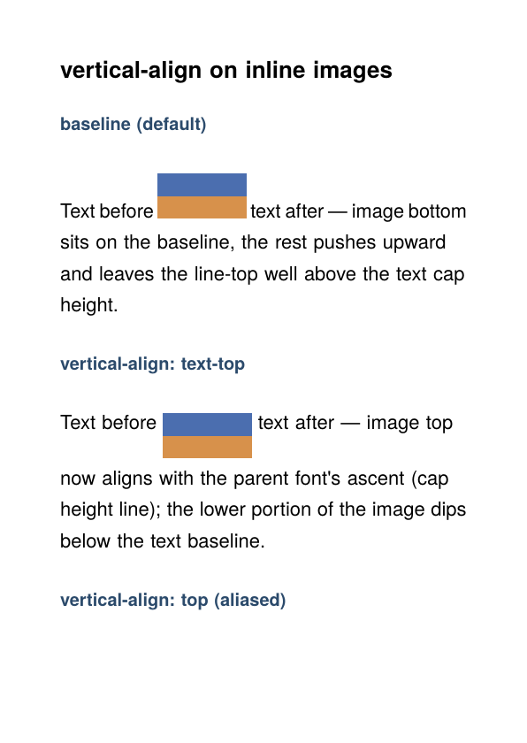

# Inline image alignment via CSS `vertical-align`

Mixed inline content (text + raster image) in a single paragraph. The
same `` tag is rendered three times in three paragraphs that differ
only in their `vertical-align`:

| Keyword                  | Effect on the image                                |
| ------------------------ | -------------------------------------------------- |
| `baseline` (default)     | Image bottom on text baseline; image overhangs up. |
| `vertical-align: text-top` | Image top at parent font's ascent (cap height); image dips below baseline. |
| `vertical-align: top`    | Aliased to `text-top` — htmlbag has no first-class line-box layout, so the line-box-relative semantics of `top` collapses to text-top for inline images. |

## How it works

`node.Image` carries a `(Height, Depth)` pair just like glyphs and
boxes. By default `Depth = 0`, so the image sits on the baseline (CSS
`baseline` semantics).

For `vertical-align: text-top`, htmlbag splits the image's visible
height:

```
ascent ≈ font-size × 0.8           // typical typoAscender ratio
image.Height = ascent               // extent above baseline
image.Depth  = visualHeight - ascent // extent below baseline
```

The horizontal renderer in `boxesandglue/backend/document/document.go`
honours `Depth` by placing the image's bottom-left at `(x, y − Depth)`
and using `Height + Depth` as the vertical scale. With `Depth = 0` it
reduces to the original baseline-anchored behaviour, so existing
documents are pixel-identical.

The `0.8` ascent ratio is a deliberate heuristic. Real fonts span
roughly 0.75–0.82 typoAscender / typoUnitsPerEm; loading the actual
face here just to read `OS/2.sTypoAscender` would be premature
optimisation, and the visual difference for typical inline images is
sub-pixel.

## Scope

v1 covers the eager raster path (`` with absolute or
no width). Two paths intentionally left unchanged:

- **SVG inline images** — `case "img" + .svg`: wrapped in a Vpack VList
  whose rendering anchors to the outer line-box-top. Already
  approximates `vertical-align: top` (line-box semantics) when the SVG
  is the tallest item on the line; differs from text-top when other
  taller content shares the line.
- **Percent-width raster** — ``: deferred
  via `newRasterImageFormatter`, also Vpack-wrapped. Same VList
  rendering quirk as SVG.

Both can be lifted to full `text-top` support by extending the
`*node.VList` case in `outputHorizontalItems` to anchor to
`v.Height` instead of the surrounding `hlist.Height`. That changes
existing behaviour for any VList inside an HList, so it's a separate
patch.

## Run

```
glu inline-image-align.html
```

(produces `inline-image-align.pdf`; this directory ships a copy as
`result.pdf`.)

## Result


