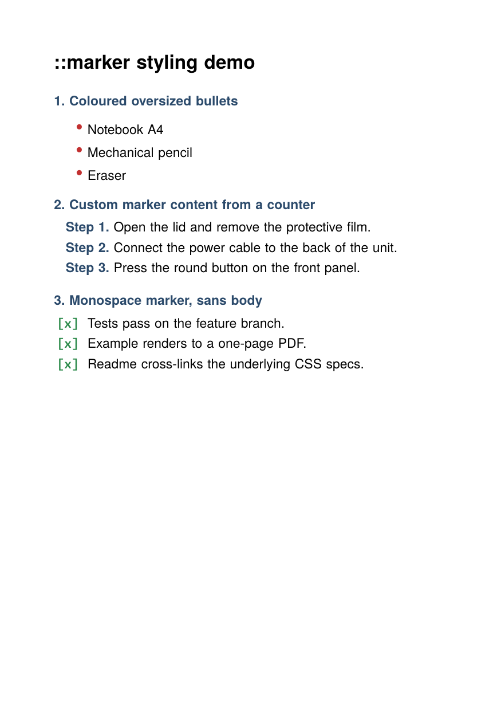

# `::marker` pseudo-element

Demonstrates the CSS Pseudo-Elements Level 4 `::marker` pseudo styling
each list's bullet or number independently from the body text. Three
lists, three marker styles, and every visual difference is driven by
a `li::marker { ... }` rule.

## What is exercised

| Selector                                       | Properties verified                         |
| ---------------------------------------------- | ------------------------------------------- |
| `ul.dots li::marker`                           | `color`, `font-size` (1.6em bullets)        |
| `ol.steps li::marker`                          | `content` with `counter()`, `color`, `font-weight` |
| `ul.checks li::marker`                         | `content`, `font-family` (monospace), `color`, `font-weight` |

Supported `::marker` properties in this build: `color`, `font-family`,
`font-size`, `font-style`, `font-weight`, `text-align`, `content`.
Other properties (background, padding, borders) are ignored, matching
the spec which restricts `::marker` to glyph-shaping properties.

The earlier `li::before { ... }` convention used by older examples
(`../numbered-sections-counters/`) still works: both pseudos feed the
same marker hbox. When both are set on the same `<li>`, `::marker`
wins.

## Run

```
glu marker-pseudo.html
```

(produces `marker-pseudo.pdf`; this directory ships a copy as
`result.pdf` plus a rendered preview as `firstpage.png`.)

## Result



## Caveat: gutter sizing

The marker hbox is anchored at `IndentLeft` (the list's
`padding-left`) and grows leftward into the gutter. If the marker
text is wider than `padding-left`, the overflow currently extends
rightward into the body text rather than leftward off the page edge.
Browsers behave the opposite way and let oversized markers hang past
the page edge. The `ol.steps` list in this example uses
`padding-left: 50pt` for that reason; a tighter gutter would collide
`Step N.` with the body.

Fixing the overflow direction is a separate item in the
`outside-marker` anchor logic and is not required for the `::marker`
feature itself.
