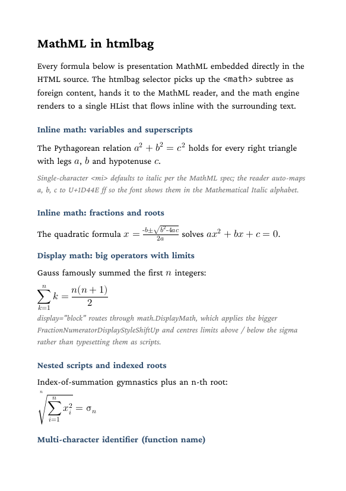

# Inline MathML (accessible, PDF/UA-2)

Showcase for the OpenType MATH project: htmlbag's native MathML reader
(Phase 3a) plus accessible math tagging (Phase 4). `<math>` elements
embedded directly in HTML are picked up as foreign content, parsed by
the MathML reader at `boxesandglue/frontend/math/mathml/`, and rendered
through the OT-MATH engine at `boxesandglue/frontend/math/`. No Pandoc,
no JavaScript, no external converter — single binary, deterministic
output.

Rendered as PDF/UA-2 (`--format PDF/UA-2`), each formula additionally
becomes a tagged `Formula` structure element carrying both a plain-text
`/Alt` fallback and the original MathML embedded as an associated file
(`/AFRelationship /Supplement`), so assistive technology can read the
math semantically. pdfa11y reports `Verdict: PASS` (0 fail).

## What is exercised

| Formula                                          | MathML elements                                     | Engine path                               |
| ------------------------------------------------ | --------------------------------------------------- | ----------------------------------------- |
| Pythagoras `a² + b² = c²`                        | `<msup>`, `<mo>`, `<mi>`                            | Inline atoms with Bin/Rel spacing         |
| Quadratic formula                                | `<mfrac>`, `<msqrt>`, nested `<msup>`               | Inline fraction + radical + scripts       |
| Gauss summation `∑ k = n(n+1)/2`                 | `<munderover>`, `<mfrac>`, big-op `<mo>∑</mo>`      | Display-mode limits placement             |
| Indexed n-th root of `∑ x_i²`                    | `<mroot>`, `<munderover>`, `<msubsup>`              | Radical with degree + nested big-op       |
| Derivative `d/dx sin(x) = cos(x)`                | `<mi>` (italic var + upright function name)         | mathvariant auto-rule                     |

## How it works end-to-end

```
HTML5 parse  →  htmlbag selection (math = foreign content)
              ↓
              `_mathmlSource` attribute carries the serialised subtree
              ↓
htmlbag inheritablestyles "case math:"  →  resolves font-family,
                                            calls mathml.Render
              ↓
mathml.Parse  →  []math.MathItem (atoms with GIDs)
              ↓
math.InlineMath / math.DisplayMath  →  *node.HList
              ↓
appended into the surrounding paragraph's Items
```

## MathVariant defaults

- `<mi>x</mi>` (single character) → defaults to italic, auto-mapped to
  U+1D44E ff (Mathematical Italic alphabet) so the font renders the
  expected `𝑥`, not the upright ASCII glyph.
- `<mi>sin</mi>` (multi character) → defaults to upright, ASCII glyphs.
  Standard convention for function names.
- `<mi mathvariant="normal">x</mi>` → forces upright on a single
  character.
- Special case: `<mi>h</mi>` maps to U+210E (Planck constant ℎ) because
  U+1D455 is a reserved Unicode slot.

## Run

```
glu mathml.html
```

The document is self-describing: `<meta name="pdf-format"
content="PDF/UA-2">` in the head switches on PDF 2.0 + structure tagging,
and the title comes from the `<title>` element — no CLI flag needed. A
`--format` flag, if given, overrides the meta tag. This directory ships
the tagged `result.pdf` plus a rendered preview as `firstpage.png`.

## Result



## Accessible math (PDF/UA-2)

Each `<math>` becomes a `Formula` structure element. For an inline
formula the renderer splits the surrounding paragraph's marked content
so the reading order is `text · formula · text`, not `text · text ·
formula`:

```
<P>
 ├─ MCID 0   "The relation "          (paragraph text before)
 ├─ <Formula>            /Alt "a 2"   /AF → formula.mml
 │    └─ MCID 1          (formula glyphs)
 └─ MCID 2   " matters."              (paragraph text after)
```

- **`/Alt`** — a plain-text fallback. Taken from the MathML `alttext`
  attribute when present, otherwise the token content (`<mi>`/`<mn>`/
  `<mo>`) concatenated in order.
- **`/AF`** — the MathML source embedded as an associated file
  (`application/mathml+xml`, `/AFRelationship /Supplement`), with the
  `xmlns="http://www.w3.org/1998/Math/MathML"` namespace re-attached so
  the file is self-describing XML. A MathML-aware reader consumes this
  for full semantics.

Verify:

```
pdfinfo result.pdf            # PDF version: 2.0, Tagged: yes
pdfa11y result.pdf            # Verdict: PASS (incl. MathML checks MH-17-*)
verapdf --flavour ua2 result.pdf
```

Under `--format PDF/UA` (UA-1, PDF 1.7) the `Formula` element and its
`/Alt` are still emitted, but the MathML associated file is not —
associated files are a PDF 2.0 feature.

## Phase 3a scope

What this Phase covers — element support:

```
<math>, <mrow>, <mstyle>, <mpadded>, <mphantom>     -- containers
<mi>, <mn>, <mo>                                    -- token leaves
<mfrac>, <msqrt>, <mroot>                           -- fraction / radical
<msup>, <msub>, <msubsup>                           -- script attachment
<munder>, <mover>, <munderover>                     -- limits / accents
<semantics> (transparent), <annotation*> (skipped)
```

Out of scope until later phases:

- `<mtable>`, `<mtr>`, `<mtd>` (matrices)
- `<mtext>`, `<mspace>` (text content, explicit spacing)
- `<menclose>` (boxed expressions)
- `mathvariant` values beyond `italic` / `normal`
  (bold, double-struck, fraktur, sans-serif, …)
- Greek-letter italic remapping (works for ASCII a–z and A–Z only)

TeX-math input (write `$x^2$` in HTML and get the same render) is
Phase 3b, deliberately deferred until the MathML path is solid.
