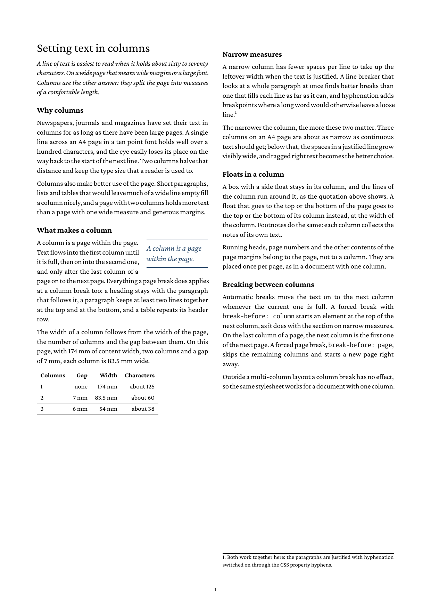

# Multi-column layout

A one-page article set in two columns with CSS Multi-column Layout:
`column-count` and `column-gap` on the `body` make every page hold two
columns, filled one after the other.



## What is exercised

| Feature | How |
| --- | --- |
| `column-count`, `column-gap` | `body { column-count: 2; column-gap: 7mm; }`: two columns of 83.5 mm on an A4 page with 174 mm of content width. |
| Column breaks | Text moves on to the second column when the first is full; headings keep with the next paragraph (`break-after: avoid`) across the column break as across a page break. |
| `break-before: column` | The section on narrow measures starts at the top of the second column. |
| Side float | The pull quote (`float: right`) stays in its column, and the text of the column runs around it. |
| Footnote | Placed at the foot of the column that holds it, as wide as the column. |
| Page margin boxes | The page number belongs to the page, not to a column. |

## Limits

Columns are laid out on the `body` only, and every page has the same
number of columns. `column-span`, balancing the columns of the last
page (`column-fill`) and `column-rule` are read but not laid out yet.

## Run

```
glu multi-column.html
```
