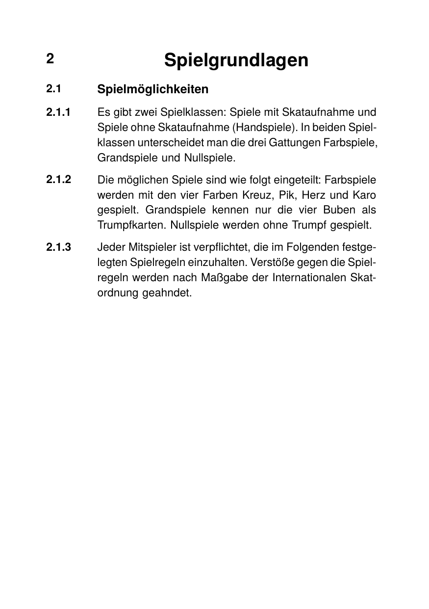

# Numbered sections (Skatordnung-style)

Reproduces the classic hanging-indent look used in legal codes and
rule books: every paragraph (and every heading) has its section
number sitting in a fixed left gutter while the body text is
justified in a flush column to the right.

The layout is a plain two-column `<table>` — the left cell carries
the number, the right cell carries the prose. No special CSS
constructs (no flex, no negative `text-indent`):

- `<colgroup>` pins the gutter to 50pt and lets the body cell take
  the rest of the page width.
- `vertical-align: top` on the cell pins the number to the first
  body line; without it cells default to vertical centering, which
  drops the number mid-paragraph on multi-line bodies.
- `text-align: justify` plus `hyphens: auto` on the body cell gives
  the block-justified look with German hyphenation.
- Heading variants are selected by adding a second class to the
  body cell (`.chapter-title`, `.section-title`); specificity beats
  the base `td.body` rule, so no `!important` is needed.

## Run

```
glu numbered-sections.html
```

(produces `numbered-sections.pdf`; this directory ships a copy as
`result.pdf` plus a rendered preview as `firstpage.png`.)

## Result


