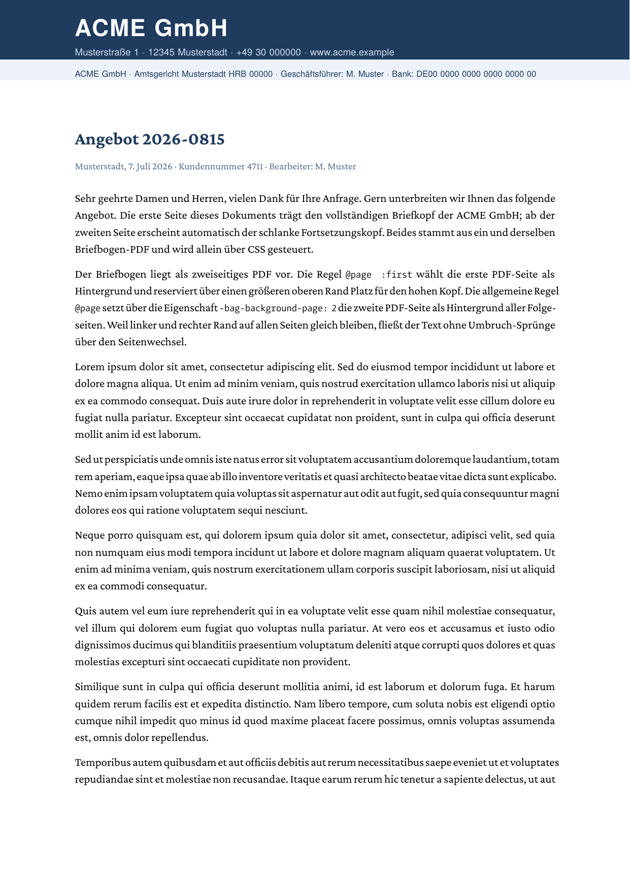

# Per-page `@page` background (letterhead)

A two-page PDF letterhead painted behind flowing body text, with a
**different letterhead on page 1 than on the following pages**, driven
entirely from CSS. No Go and no Lua callback: this works straight from
plain HTML or Markdown through `glu`.

## What is exercised

| Feature | How |
| --- | --- |
| `@page { background-image: url(...) }` | Paints a raster image or imported PDF page across the whole sheet, behind the content. |
| Per-page selection via `@page :first` | Page 1 uses page 1 of the letterhead (tall corporate header); the generic `@page` covers pages 2+. |
| `-bag-background-page: <n>` | Selects the source page of a multi-page PDF (default `1`). Here `2` picks the slim continuation header for pages 2+. |
| Per-page `margin-top` | `@page :first` reserves a taller top margin so the body clears the tall header; left/right margins stay equal so the text column keeps one width and flows across the break. |

The letterhead is resolved relative to the document, so the bare
filename `url(letterhead.pdf)` next to the HTML is found (the
glu/Markdown route resolves through the document directory).

## Files

| File | Role |
| --- | --- |
| `page-background-letterhead.html` | The runnable demo. |
| `letterhead.pdf` | The two-page stationery used as the `@page` background. |
| `letterhead-source.html` | Source that generated `letterhead.pdf` (`glu letterhead-source.html`); shipped for reference, not needed to run the demo. |

## Run

```
glu page-background-letterhead.html
```

(produces `page-background-letterhead.pdf`; this directory ships a copy as
`result.pdf` plus rendered previews.)

## Result

Page 1 carries the full corporate header (source page 1); every following
page carries the slim continuation header (source page 2).

Page 1 | Page 2
--- | ---
 | 

## Cascade gotcha: set `-bag-background-page` on every rule

`@page :first` cascades over the generic `@page`: it inherits every
property it does not redeclare, including `-bag-background-page`. So if
`@page` sets `-bag-background-page: 2` and `:first` leaves it out, page 1
inherits `2` and shows the wrong source page. Set the page number
explicitly on each rule (this example sets `-bag-background-page: 1` on
`:first`). The default of `1` only applies when no rule in the cascade
sets it at all.

## Notes and limits

- `background-image` accepts raster images (PNG, JPEG) and PDF pages. SVG
  page backgrounds are not yet supported.
- `background-color` on `@page` currently fills page 1 only.
- Keep the left and right margins equal across pages. A later page with a
  different content **width** does not reflow the running text; only
  vertical geometry (a different `margin-top` / `margin-bottom`) reflows
  cleanly. See the htmlbag [limitations](https://boxesandglue.dev/htmlbag/limitations).
