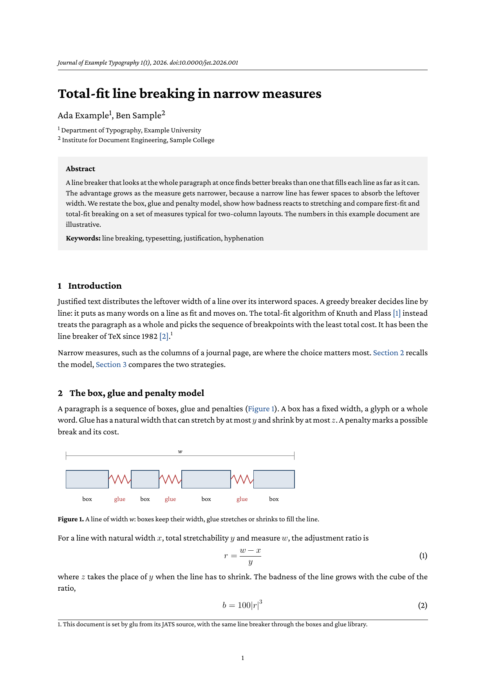

# JATS article

A journal article in [JATS](https://jats.nlm.nih.gov/) (Journal Article
Tag Suite, ANSI/NISO Z39.96), the XML format of PubMed Central and many
scientific publishers, typeset with glu. The Lua walker `jats.lua` reads
the XML with `xml.cxpath`, builds HTML in memory and hands it to glu's
HTML pipeline; `jats.css` does the layout.

The walker is a proof of concept, not a JATS processor. It covers the
parts of JATS a typical research article uses; an element it does not
know is unwrapped, its content kept.



## Run

```
glu jats.lua article.xml
```

`keep-html` also writes the generated HTML next to the input,
`out=NAME` sets the name of the PDF.

## What the walker covers

JATS | HTML
--- | ---
`journal-meta`, `article-id`, `volume`, `issue`, `pub-date` | journal line above the title
`article-title`, `contrib` with `name`, `aff` | title, authors with affiliation marks, affiliations
`abstract`, `kwd-group` | abstract box with keywords
`sec` with `label` and `title` | `section` with a numbered heading, nested levels as `h2` to `h6`
`p`, `list`, `disp-quote` | `p`, `ol`/`ul`, `blockquote`
`fig` with `graphic`, `alt-text`, `label`, `caption` | `figure` with `img` and `figcaption`
`table-wrap` with an XHTML `table` | `table` with `caption`, cells copied
`disp-formula`, `inline-formula` with MathML | `math` without the `mml:` prefix; display formulas centered with the label at the right margin
`xref` | link to the target; `ref-type="fn"` puts the `fn` there as a footnote
`italic`, `bold`, `sup`, `sub`, `monospace`, `sc`, `ext-link` | inline HTML
`ref-list` with `mixed-citation` or `element-citation` | numbered list of references, `source` in italics
`ack` | section

Labels and the text of cross references come from the JATS source, as
JATS keeps them there. The math font is the Latin Modern Math of the
[scientific paper](../markdown/scientific-paper) example.
