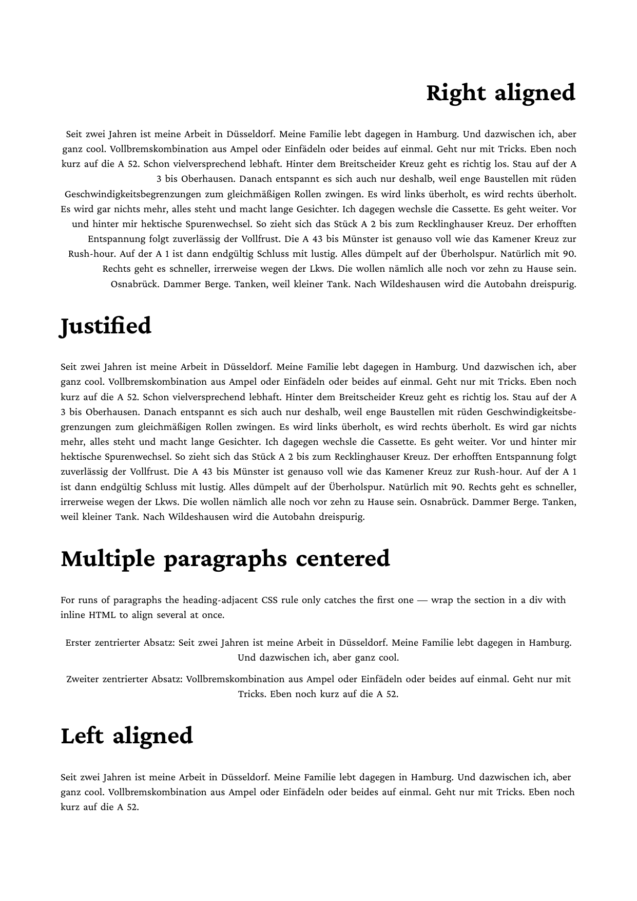
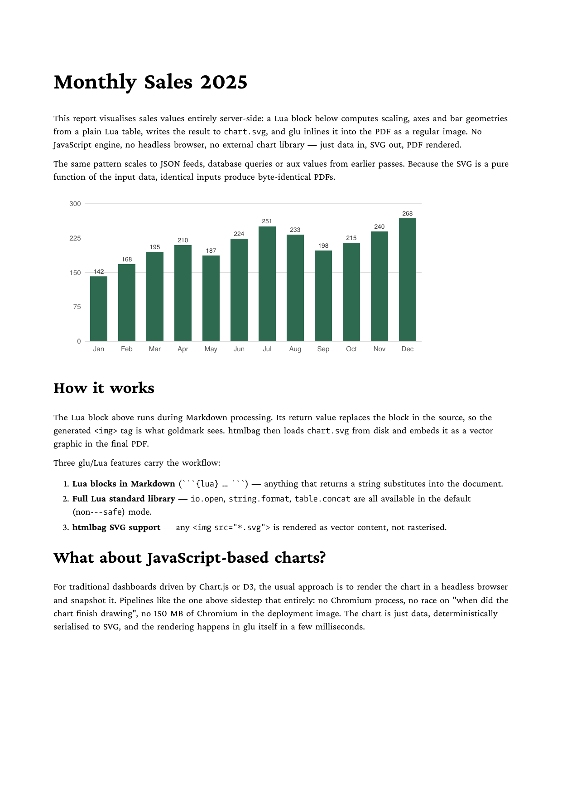
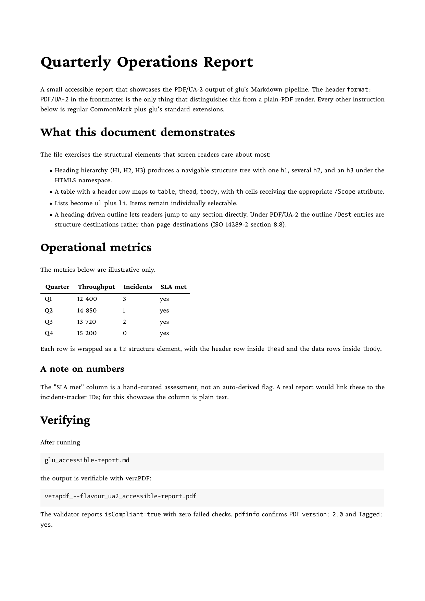

# Markdown examples

glu's Markdown pipeline takes a `.md` file with optional YAML
frontmatter, embedded Lua blocks (``` ```{lua} … ``` ```), inline
expressions `{= expr =}` and any HTML5 fragments mixed in, and
produces a PDF. Each example ships a `.md` source, a `result.pdf`
and a `firstpage.png` preview.

## Examples

Description | Preview
--- | ---
[Alignment](alignment) — `# Heading {.right}` syntax, `-bag-linebreak-*` Knuth-Plass tuning, German hyphenation | <a href="alignment"></a>
[Barcodes](barcodes) — `<barcode>` element: EAN-13, Code 128 and QR code in one document | <a href="barcodes"></a>
[Cross references, inline](cross-reference-inline) — `target-text()` and `target-counter()` resolving against inline anchors via the aux roundtrip | <a href="cross-reference-inline"></a>
[Table of contents](toc-target-counter) — `target-counter()` page numbers and `leader()` dot fills for a generated TOC | <a href="toc-target-counter"></a>
[Chart from data](chart-from-data) — a Lua block turns a plain Lua table into an SVG bar chart that htmlbag embeds inline | <a href="chart-from-data"></a>
[Slides](slides) — Markdown → 16:9 slide deck with hobby-curve accents and per-slide layout | <a href="slides"></a>
[Accessible report (PDF/UA-2)](accessible-report) — `format: PDF/UA-2` frontmatter switch, HTML5-namespaced structure tree, veraPDF UA-2 conformant | <a href="accessible-report"></a>

## Workflow

```bash
glu <name>.md
```

writes `<name>.pdf` and a companion `<name>-aux.json` (the
cross-reference / TOC / Lua-persistent-state file). Subsequent runs
re-read the aux file, so cross-references converge across multiple
passes. The multi-pass loop runs automatically — converges when the
aux file is byte-identical to the previous pass.

## Pipeline stages

A `.md` file flows through:

1. Optional Go `text/template` expansion (`--template`).
2. YAML frontmatter extraction — recognised keys: `title`, `author`,
   `css`, `papersize`, `format`, `lang`, `highlight-style`.
3. Companion `.lua` file loaded if it exists (registers lifecycle
   callbacks).
4. Aux file read; `_aux` and `_toc = _aux._headings` exposed to Lua.
5. Lua block expansion: ``` ```{lua} ``` blocks replaced by their
   return value; inline `{= expr =}` evaluated.
6. Markdown → HTML via `goldmark` (Table, Strikethrough, Linkify,
   chroma highlighting, `WithAttribute` for `{.class}` suffixes).
7. HTML → PDF via `htmlbag`.
8. Aux write-back; pipeline re-runs if aux changed.

The shared HTML rendering core is the same `renderHTMLToPDF` used by
plain-HTML mode — Markdown mode just adds steps 1–6 in front.

## What's exercised across the cluster

| Feature | Where |
|---|---|
| YAML frontmatter | every example uses it |
| `{.class}` heading suffix → `class=` | `alignment` |
| Knuth-Plass linebreak tuning (`-bag-linebreak-*`) | `alignment` |
| Per-language hyphenation (German patterns) | `alignment` |
| `<barcode>` HTML element | `barcodes` |
| `target-text()` / `target-counter(attr(href), page)` | `cross-reference-inline`, `toc-target-counter` |
| `leader()` fil³-stretchy glue with dot pattern | `toc-target-counter` |
| Embedded Lua block returning HTML/SVG | `chart-from-data` |
| Lua module imports inside `{lua}` blocks | `chart-from-data` |
| Multi-slide layout with per-section CSS | `slides` |
| `hobby` MetaPost-style curve drawing in CSS background | `slides` |
| Multi-pass aux convergence | every example with cross-references or TOC |

## PDF/UA

Set `format: PDF/UA` (or `PDF/UA-1`) in frontmatter (plus `lang:` and
`title:`) to opt into the PDF/UA-1 tagged-PDF pipeline: htmlbag emits
StructTreeRoot, MarkInfo, `/DisplayDocTitle`, role-mapped element
tree, and XMP `pdfuaid:part 1` metadata. For PDF/UA-2 (ISO 14289-2 on
PDF 2.0) use `format: PDF/UA-2`: the structure tree uses the HTML5
namespace with `RoleMapNS` to the PDF Standard Structure Namespace,
outline destinations are structure destinations, and XMP carries
`pdfuaid:part 2` plus `pdfuaid:rev 2024`.

The `accessible-report` example exercises the UA-2 path
end-to-end; the xslfo cluster's examples 10 (UA-1) and 11 (UA-2)
do the same from XSL-FO input.

For the full glu Markdown-pipeline reference, see the
[glu handbook](https://boxesandglue.dev/glu/) (or the local
`boxesandglue-website/content/glu/` source).
