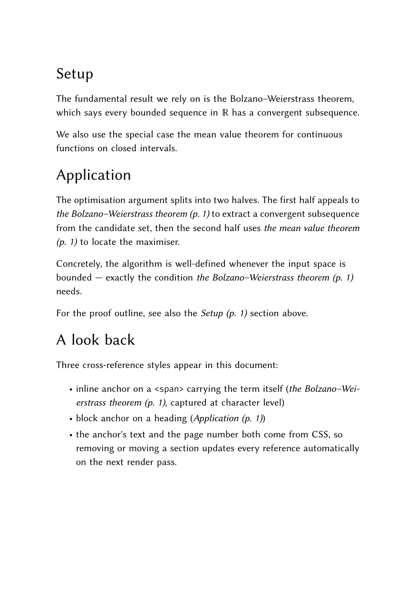

# Cross-references with inline anchors

Demonstrates CSS `target-text()` and `target-counter()` resolving
against **inline** anchor targets (`<span id="...">`) as well as
block-level ones (`<h1 id="...">`). The link-text and page-number of
every reference is generated in CSS, not typed into the source.

The key idea: an `<a class="ref" href="#some-id"></a>` carries no
text of its own. CSS fills it in:

```css
a.ref::before { content: target-text(attr(href)); }
a.ref::after  { content: " (p. " target-counter(attr(href), page) ")"; }
```

`target-text` pulls the captured text from the anchor element (whether
that anchor is an inline `<span>` or a block heading). `target-counter`
pulls the page where the anchor was painted. Both are resolved from
`refs-aux.json`, which glu writes on each pass.

## Run

```
glu refs.md
```

## What gets tracked

| Source                                         | Type           |
|------------------------------------------------|----------------|
| `<span id="thm-bw">the Bolzano–Weierstrass …`  | inline anchor  |
| `<span id="thm-mvt">the mean value theorem`    | inline anchor  |
| `# Setup {#setup}`                             | block anchor   |
| `# Application {#application}`                 | block anchor   |

A reference like `<a class="ref" href="#thm-bw"></a>` renders as
*the Bolzano–Weierstrass theorem (p. 1)*. Move or rename a section
and every reference updates on the next render pass automatically.

## Anchor text capture

The text shown by `target-text(attr(href))` is the textual content of
the referenced element at collection time:

- Inline anchors keep their span text verbatim
  (`"the Bolzano–Weierstrass theorem"`).
- Block anchors keep the rendered heading text (`"Application"`).
- Block anchors over 200 characters are truncated with a trailing `…`
  to keep the aux file bounded; inline anchors are usually well below
  that and pass through verbatim.

## Multi-pass details

`glu` runs the document twice (sometimes three times) before the
output stabilises:

1. **Pass 1.** Anchor positions are unknown. Every reference renders
   as `?` for both text and page. Anchors get collected and written
   to `refs-aux.json` together with their captured text.
2. **Pass 2.** The aux file is read back. References now show real
   text and real page numbers.
3. **Pass 3 (rare).** Only if the wider rendered references push line
   breaks around, changing the page some anchor sits on.

If `--max-passes 3` isn't enough (heavy back-references with many
text-length changes), pass `--max-passes 5`.

## Result



## Reproducing result.pdf

```
SOURCE_DATE_EPOCH=1747000000 glu refs.md
md5 refs.pdf result.pdf   # both hashes must match
```

## Related examples

- `../toc-target-counter/` — same machinery used for an automatic
  table of contents with dot-leader and right-aligned page numbers.
