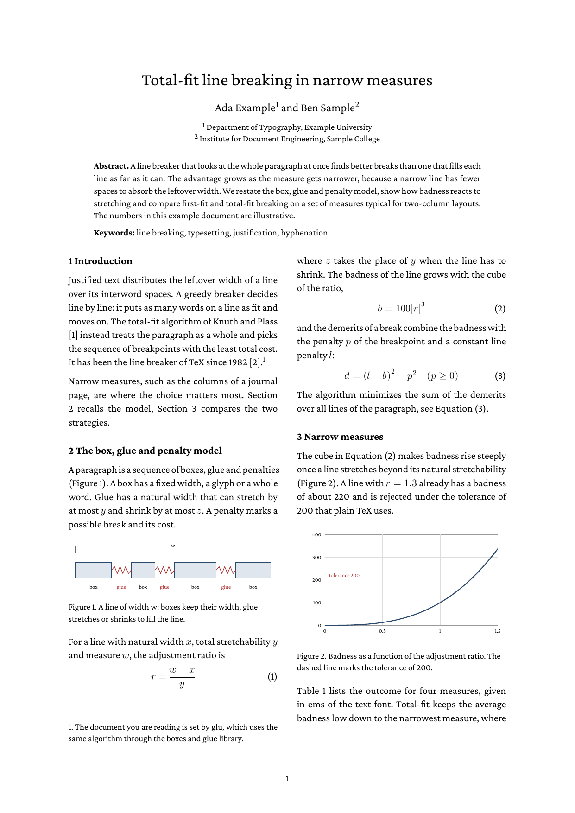

# Scientific paper

A short journal-style article written in Markdown, set in two columns
and tagged as PDF/UA-2: title block with authors and affiliations and an abstract
across both columns, then numbered sections, inline and numbered
display equations, two figures, a table, a footnote, cross references
and a hand-made list of references.



## Run

```
glu scientific-paper.md
```

## How it is built

- **Two columns** come from a fenced div around everything after the
  abstract, with `column-count: 2`. The title block and the abstract
  are its siblings and span both columns; the columns of the last page
  are balanced.

  ```markdown
  ::: {.paper-body}
  ## Introduction {#sec-intro}
  ...
  :::
  ```

  ```css
  .paper-body { column-count: 2; column-gap: 7mm; }
  figure img { max-width: 100%; }
  ```

- **Formulas** use TeX dollar syntax (`math: true` in the frontmatter)
  and the Latin Modern Math font.
- **Numbered equations** are paragraphs with two tab stops: the formula
  is centered at 50 %, the number from `::after` ends at the right
  margin. `\displaystyle` sets a fraction in such a paragraph at full
  size, as in a display formula.

  ```markdown
  &Tab;$b = 100|r|^3$&Tab;
  {#eq-badness .equation}
  ```

  ```css
  p.equation {
    -bag-tab-stops: 50% center, 100% end;
    counter-increment: equation;
  }
  p.equation::after { content: "(" counter(equation) ")"; }
  ```

- **Numbers** for sections, figures, tables and equations are CSS
  counters. A cross reference is an empty link whose text comes from
  `target-counter()`, so it follows the document when sections or
  figures move:

  ```html
  see <a class="fig" href="#fig-model"></a>
  ```

  ```css
  a.fig::before { content: "Figure " target-counter(attr(href), figure); }
  ```

- **The running head** from page 2 on is a running element
  (`position: running(runningtitle)`), switched off on the first page
  with `@page :first`.
- **The footnote** is a Markdown footnote (`[^impl]`), set at the foot
  of its column.
- **References** are an ordered list with an id per entry; citations
  link to them.

The figures are SVG files with labels in `serif`, the font an SVG in
`` takes without a `font-family`.

## Accessibility

`format: PDF/UA-2` in the frontmatter tags the paper. veraPDF
(`verapdf --flavour ua2 result.pdf`) reports it compliant: the cross
references point to the structure elements of their targets, each
figure is a section with the image's alt text and its caption, and the
table caption is the first child of the table.
