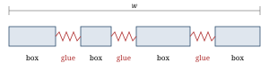
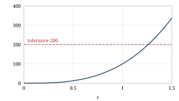

Total-fit line breaking in narrow measures

# Total-fit line breaking in narrow measures

::: {.authors}
Ada Example1 and Ben Sample2
:::

::: {.affiliations}
1 Department of Typography, Example University\
2 Institute for Document Engineering, Sample College
:::

::: {.abstract}
**Abstract.** A line breaker that looks at the whole paragraph at once
finds better breaks than one that fills each line as far as it can.
The advantage grows as the measure gets narrower, because a narrow
line has fewer spaces to absorb the leftover width. We restate the
box, glue and penalty model, show how badness reacts to stretching
and compare first-fit and total-fit breaking on a set of measures
typical for two-column layouts. The numbers in this example document
are illustrative.

**Keywords:** line breaking, typesetting, justification, hyphenation
:::

::: {.paper-body}

## Introduction {#sec-intro}

Justified text distributes the leftover width of a line over its
interword spaces. A greedy breaker decides line by line: it puts as
many words on a line as fit and moves on. The total-fit algorithm of
Knuth and Plass <a class="cite" href="#ref-knuth-plass">[1]</a>
instead treats the paragraph as a whole and picks the sequence of
breakpoints with the least total cost. It has been the line breaker of
TeX since 1982 <a class="cite" href="#ref-texbook">[2]</a>.[^impl]

Narrow measures, such as the columns of a journal page, are where the
choice matters most.  recalls the
model,  compares the two
strategies.

[^impl]: The document you are reading is set by glu, which uses the
same algorithm through the boxes and glue library.

## The box, glue and penalty model {#sec-model}

A paragraph is a sequence of boxes, glue and penalties
(). A box has a fixed width, a
glyph or a whole word. Glue has a natural width that can stretch by
at most $y$ and shrink by at most $z$. A penalty marks a possible
break and its cost.

<figure id="fig-model">

<figcaption>A line of width w: boxes keep their width, glue stretches
or shrinks to fill the line.</figcaption>
</figure>

For a line with natural width $x$, total stretchability $y$ and
measure $w$, the adjustment ratio is

&Tab;$\displaystyle r = \frac{w - x}{y}$&Tab;
{#eq-ratio .equation}

where $z$ takes the place of $y$ when the line has to shrink. The
badness of the line grows with the cube of the ratio,

&Tab;$b = 100|r|^3$&Tab;
{#eq-badness .equation}

and the demerits of a break combine the badness with the penalty $p$
of the breakpoint and a constant line penalty $l$:

&Tab;$d = (l + b)^2 + p^2 \quad (p \ge 0)$&Tab;
{#eq-demerits .equation}

The algorithm minimizes the sum of the demerits over all lines of the
paragraph, see .

## Narrow measures {#sec-narrow}

The cube in  makes badness rise
steeply once a line stretches beyond its natural stretchability
(). A line with $r = 1.3$
already has a badness of about 220 and is rejected under the
tolerance of 200 that plain TeX uses.

<figure id="fig-badness">

<figcaption>Badness as a function of the adjustment ratio. The dashed
line marks the tolerance of 200.</figcaption>
</figure>

 lists the outcome for four
measures, given in ems of the text font. Total-fit keeps the average
badness low down to the narrowest measure, where first-fit leaves
loose lines that a reader notices as rivers of white space.

<table id="tab-results">
<caption>Average badness b and loose lines (b > 200) per 100 lines,
first-fit (FF) against total-fit (TF). Illustrative values.</caption>
<thead>
<tr><th>Measure</th><th>FF b</th><th>TF b</th><th>FF loose</th><th>TF loose</th></tr>
</thead>
<tbody>
<tr><td>35&nbsp;em</td><td>18</td><td>9</td><td>1</td><td>0</td></tr>
<tr><td>28&nbsp;em</td><td>31</td><td>14</td><td>3</td><td>0</td></tr>
<tr><td>22&nbsp;em</td><td>57</td><td>23</td><td>8</td><td>1</td></tr>
<tr><td>16&nbsp;em</td><td>112</td><td>41</td><td>19</td><td>4</td></tr>
</tbody>
</table>

Hyphenation widens the gap further: it adds breakpoints, and only an
algorithm that weighs them against each other can use them without
hyphenating every other line. Plass extended the same idea from lines
to pages <a class="cite" href="#ref-plass">[3]</a>; the CSS
multi-column module <a class="cite" href="#ref-css-multicol">[4]</a>
describes how columns are filled, but leaves the line breaker to the
implementation.

## Conclusion {#sec-conclusion}

Breaking a paragraph as a whole costs more computation than breaking
it line by line, but the cost is small for a modern machine and the
gain is largest exactly where journals set their text: in narrow
columns.

## References {#sec-references .unnumbered}

<ol class="references">
<li id="ref-knuth-plass">D. E. Knuth and M. F. Plass. Breaking paragraphs into lines. <i>Software: Practice and Experience</i>, 11(11):1119–1184, 1981.</li>
<li id="ref-texbook">D. E. Knuth. <i>The TeXbook</i>. Addison-Wesley, Reading, MA, 1984.</li>
<li id="ref-plass">M. F. Plass. <i>Optimal Pagination Techniques for Automatic Typesetting Systems</i>. PhD thesis, Stanford University, 1981.</li>
<li id="ref-css-multicol">W3C. <i>CSS Multi-column Layout Module Level 1</i>. W3C Candidate Recommendation.</li>
</ol>

:::
