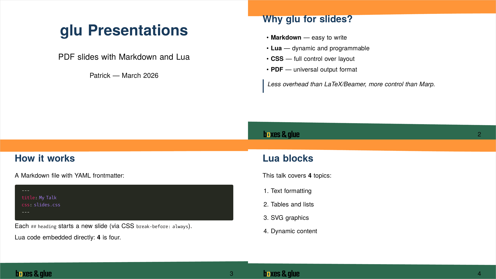

# Slides Example

This example demonstrates how to create PDF presentation slides with [glu](https://boxesandglue.dev/glu/) using Markdown, Lua, and CSS.



## Prerequisites

Install glu using one of these methods:

**Homebrew** (macOS / Linux):

```
brew install boxesandglue/tap/glu
```

**Pre-built binaries** (no Go required):

Download the latest release from <https://github.com/speedata/glu/releases/latest>.

**Build from source** (requires Go):

```
git clone https://github.com/speedata/glu
cd glu
rake build
```

See <https://boxesandglue.dev/glu/> for full installation instructions.

## Running

```
glu slides.md
```

This produces `slides.pdf`.

## Files

| File | Purpose |
|------|---------|
| `slides.md` | Slide content in Markdown with YAML frontmatter and embedded Lua blocks |
| `slides.lua` | Companion Lua file — draws decorative accent lines on each slide using the [hobby](https://boxesandglue.dev/hobby/) curve library |
| `slides.css` | Slide layout — 16:9 page size, `break-before: always` on `h2` for automatic slide breaks, title slide styling |

## How it works

- Each `## heading` starts a new slide (via CSS `break-before: always`).
- Lua code blocks (`` ```{lua} ``) are executed during Markdown processing. Use `return` to insert the result into the document.
- Inline expressions `{= expr =}` are replaced with their Lua result.
- The companion file `slides.lua` is loaded automatically and registers a `page_init` callback that draws randomized accent lines at the top and bottom of each content slide.
- Setting `format: PDF/UA` in the frontmatter produces a tagged, accessible PDF.
