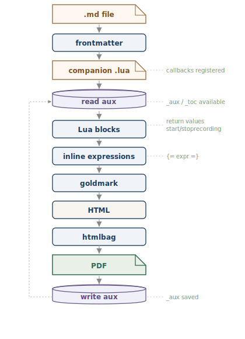

<div class="title-slide">

# glu Presentations

<p class="subtitle">PDF slides with Markdown and Lua</p>

<p class="author">Patrick — March 2026</p>

</div>

<h2 id="why">Why glu for slides?</h2>

- **Markdown** — easy to write
- **Lua** — dynamic and programmable
- **CSS** — full control over layout
- **PDF** — universal output format

> Less overhead than LaTeX/Beamer, more control than Marp.

## How it works

A Markdown file with YAML frontmatter:

```yaml
---
title: My Talk
css: slides.css
---
```

Each `## heading` starts a new slide (via CSS `break-before: always`).

Lua code embedded directly: **{= 2 + 2 =}** is four.

## Lua blocks

```{lua}
-- Lua code is executed before Markdown rendering
topics = {
    "Text formatting",
    "Tables and lists",
    "SVG graphics",
    "Dynamic content",
}
```

This talk covers **{= #topics =}** topics:

```{lua}
local lines = {}
for i, t in ipairs(topics) do
    lines[#lines + 1] = i .. ". " .. t
end
return table.concat(lines, "\n\n")
```

## The Markdown pipeline



## Tables

| Feature         | Supported |
|-----------------|-----------|
| Markdown syntax | Yes       |
| CSS styling     | Yes       |
| Lua logic       | Yes       |
| SVG graphics    | Yes       |
| Page numbers    | Yes       |

## Callbacks for recurring elements

In the companion file `slides.lua`:

- **page\_init** — page number, accent line, logo
- **pre\_shipout** — final adjustments before rendering
- **document\_end** — post-processing

```{!lua}
frontend.add_callback("page_init", "slide_number",
    function(doc, page, pagenum, pageinfo)
        -- page number in the bottom right
    end)
```


## Lua blocks: syntax

This is what a Lua block looks like in Markdown:

`````
```{lua}
-- executed and the result is inserted
items = { "Item 1", "Item 2" }
return "There are " .. #items .. " items."
```
`````

Inline expressions with **\{= … =\}** are replaced directly.

To only **display** code (without executing): **\{!lua\}** instead of \{lua\}.

## Verbatim blocks

Want to display code blocks with ```` ``` ```` verbatim? Simply wrap them with more backticks:

`````
```{lua}
return "Hello from Lua!"
```
`````

The outer 5 backticks protect the inner block — it is **displayed**, not executed.

## Lua blocks: live example

```{lua}
example = { "Apples", "Pears", "Cherries" }
```

```{lua}
return "**" .. #example .. "** kinds of fruit: " .. table.concat(example, ", ")
```

And the same as a non-executed block with \{!lua\}:

```{!lua}
example = { "Apples", "Pears", "Cherries" }
return #example .. " kinds of fruit"
```

## Thank you!

Source code: `playground/slides.md`

Back to: <a href="#why">Why glu for slides?</a>

Run with:

```
glu slides.md
```
