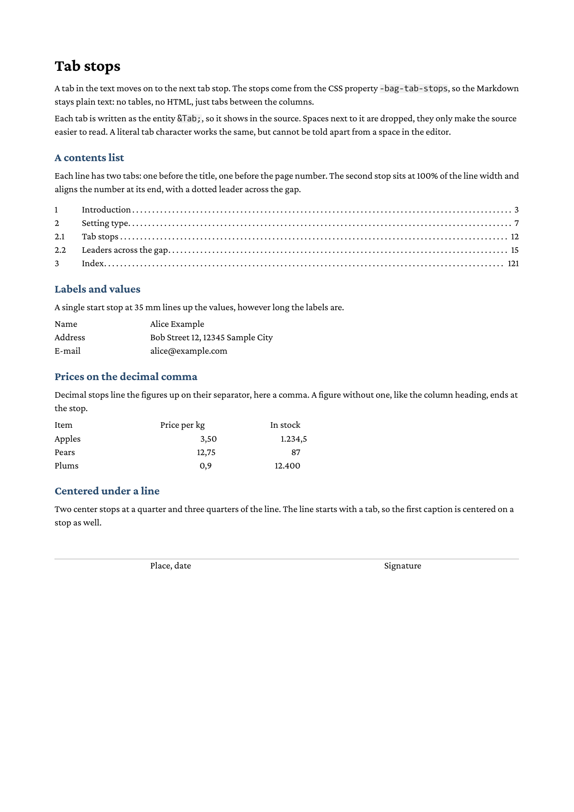

# Tab stops

This example sets text in columns with tab stops instead of tables: a
contents list with a dotted leader, a label and value block, prices
lined up on the decimal comma and two captions centered under a line.
The Markdown holds plain text with a `&Tab;` between the columns, the
stops come from the CSS property `-bag-tab-stops`.



## Prerequisites

Install glu using one of these methods:

**Homebrew** (macOS / Linux):

```
brew install boxesandglue/tap/glu
```

**Pre-built binaries** (no Go required):

Download the latest release from <https://github.com/boxesandglue/glu/releases/latest>.

See <https://boxesandglue.dev/glu/> for full installation instructions.

## Running

```
glu tab-stops.md
```

This produces `tab-stops.pdf` (this directory ships a copy as
`result.pdf`).

## Files

| File | Purpose |
|------|---------|
| `tab-stops.md` | Markdown source with `&Tab;` between the columns |
| `tab-stops.css` | Stylesheet: one `-bag-tab-stops` rule per block, `white-space: pre-line` to keep the line breaks |

## The property

```css
-bag-tab-stops: none | <tab-stop>#
<tab-stop> = <length-percentage>
             [ start | end | center | decimal | decimal(<string>) ]?
             [ leader(<string> | dotted | solid | space) ]?
```

| Part | Meaning |
|------|---------|
| `40mm`, `2em` | Position of the stop, measured from the start of the line |
| `100%` | A percentage of the line width, `100%` is the end of the line |
| `start` (default) | The text after the tab starts at the stop |
| `end` | The text ends at the stop |
| `center` | The text is centered on the stop |
| `decimal`, `decimal(",")` | The separator (`.` by default) sits at the stop; text without it ends at the stop |
| `leader(dotted)` | Fills the tab with a pattern: `dotted`, `solid`, `space` or a string such as `leader(" . ")` |

`left` and `right` are accepted as synonyms of `start` and `end`. The
property is inherited, so a rule on a container applies to all
paragraphs inside, and `none` switches inherited stops off. A tab
advances to the first stop past the text before it; after the last
stop it has the width of `tab-size`.

## Writing tabs

The example writes every tab as the entity `&Tab;` (or `&#9;`), so it
shows in the source:

```markdown
Name &Tab; Alice Example
```

With stops set, spaces next to a tab are dropped, so they are free to
make the source readable. A literal tab character works the same, but
it looks like a space in the editor, some editors turn it into spaces,
and at the start of a line Markdown reads it as indentation (a code
block in the first line of a paragraph, removed on a following line).
The entity has none of these problems, also at the start of a line.

The tab survives every `white-space` mode. Whitespace that contains a
newline is source formatting and collapses as usual. This example sets
`white-space: pre-line` only to keep the line breaks of the Markdown
paragraphs, so that one paragraph holds all lines of a block.

See the [glu documentation](https://boxesandglue.dev/glu/markdown/) and
the [htmlbag CSS reference](https://boxesandglue.dev/htmlbag/) for the
full property catalog.
