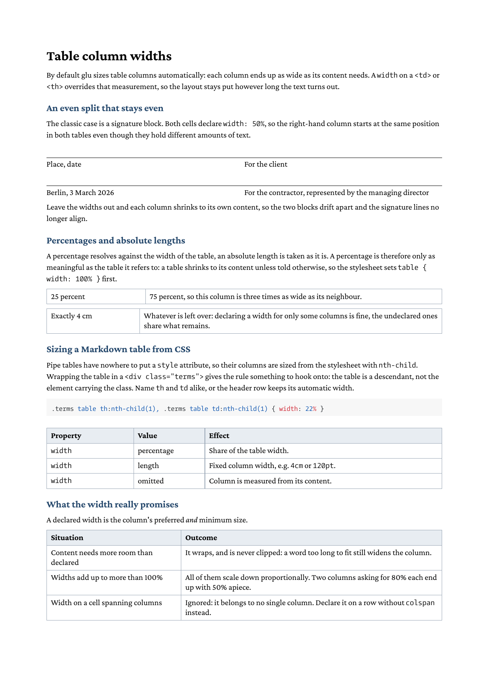

# Table column widths

This example shows how to control the width of table columns in glu's
Markdown pipeline: with a `width` on a `<td>`/`<th>` for inline HTML
tables, and with `nth-child` rules in a stylesheet for Markdown pipe
tables, which have nowhere to put a `style` attribute.



## Prerequisites

Install glu using one of these methods:

**Homebrew** (macOS / Linux):

```
brew install boxesandglue/tap/glu
```

**Pre-built binaries** (no Go required):

Download the latest release from <https://github.com/boxesandglue/glu/releases/latest>.

See <https://boxesandglue.dev/glu/> for full installation instructions.

## Running

```
glu table-column-widths.md
```

This produces `table-column-widths.pdf` (this directory ships a copy as
`result.pdf`).

## Files

| File | Purpose |
|------|---------|
| `table-column-widths.md` | Markdown source: signature block, percentage and absolute widths, a pipe table sized from CSS |
| `table-column-widths.css` | Stylesheet: `table { width: 100% }`, cell borders, and the `nth-child` column rules |

The signature block is a borderless table whose cells carry a
`border-top`: the rule above each caption is the cell's own top border,
and the space to sign in is the table's top margin. That keeps the cell
content to a single text run, which lays out more predictably than an
empty spacer element inside the cell.

## How column sizing works

Without any `width`, the table layout measures every cell and gives each
column the room its content needs. That is a good default for data
tables, but it means the column boundaries move as soon as the text
changes — two signature blocks under each other end up misaligned.

A `width` on a cell overrides the measurement for that column. It is
both the column's preferred and its minimum size, so the column keeps
its share even when the content is narrower.

| Value | Meaning |
|-------|---------|
| `width: 50%` | Half of the table width. Percentages resolve against the table, not the page. |
| `width: 4cm` | Fixed column width. Any CSS length works (`cm`, `mm`, `pt`, `in`, `em`). |
| omitted | Column is measured from its content and shares whatever the declared columns leave over. |

Three edge cases are worth knowing:

- **Content needs more room than declared.** The text wraps inside the
  declared width and is never clipped; a single word too long to fit
  still widens the column.
- **Declared widths add up to more than 100%.** They are scaled down
  proportionally so the table still fits. Two columns asking for 80%
  each end up with 50% apiece.
- **A cell that spans columns.** `width` on a cell with `colspan` is
  ignored, because it cannot be attributed to one column. Declare the
  widths on a row without `colspan`.

## Percentages need a table width

A table shrinks to its content unless told otherwise, and a percentage
on a cell resolves against the table — so on a shrunk table, `50%` is
half of the content width, not half of the page. Set the table width
first:

```css
table { width: 100% }
```

## Sizing a Markdown pipe table

Pipe tables generate a bare `<table>` with no place for a `style`
attribute. Wrap the table in a `<div>` with a class and select the
columns from the stylesheet:

```markdown
<div class="terms">

| Property | Value | Effect |
|----------|-------|--------|
| `width`  | percentage | Share of the table width. |

</div>
```

```css
.terms table th:nth-child(1), .terms table td:nth-child(1) { width: 22% }
.terms table th:nth-child(2), .terms table td:nth-child(2) { width: 18% }
.terms table th:nth-child(3), .terms table td:nth-child(3) { width: 60% }
```

Two details matter here. The class sits on the `<div>`, so the selector
has to reach the table as a descendant (`.terms table`, not
`table.terms`). And every rule has to name `th` and `td` alike —
selecting only `td` leaves the header row at its automatic width, and
the header stops lining up with the body.

The blank lines around the pipe table inside the `<div>` are required:
without them the Markdown parser treats the whole block as raw HTML and
never builds a table from the pipe syntax.

See the [glu documentation](https://boxesandglue.dev/glu/markdown/) and
the [htmlbag CSS reference](https://boxesandglue.dev/htmlbag/) for the
full property catalogue.
