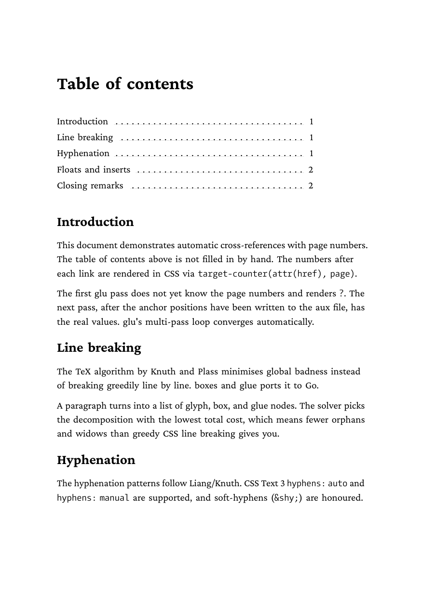

# target-counter and leader — automatic table of contents

Demonstrates CSS `target-counter(attr(href), page)` for cross-references
with page numbers, combined with `leader(".")` for stretchy dot leaders.
The table of contents at the top of `toc.md` only contains links. The
page numbers are generated in CSS from the anchor positions, and the
dots between title and page number are emitted as a fil³-stretched
glue with a repeated pattern (a TeX `\dotfill` in CSS clothing).

The TOC entries sit in a fixed-width block (`.toc li { width: 9cm; }`)
so the leader has a definite stretch target. Without an explicit width
the leader would expand to the surrounding line width.

## Run

```
glu toc.md
```

## What happens internally

glu renders the document multiple times:

1. **Pass 1:** page numbers are unknown. Every `target-counter()` call
   renders `?`. During layout the anchor positions of all `id="..."`
   elements are collected and written to `toc-aux.json` under
   `_anchors: {introduction: 2, ...}`.

2. **Pass 2:** the aux file is read and the map is handed to the CSS
   evaluator. `target-counter()` calls now render real numbers. If the
   new layout (a three-digit page number takes more space than `?`, or
   a TOC line wraps differently) shifts page positions further, a
   third pass runs.

3. **Convergence:** as soon as `toc-aux.json` is identical between two
   passes, the loop terminates. The default limit is `--max-passes 3`.

## Anchor limits in v1

- Only block-level ids are tracked: `# Chapter {#introduction}` and
  `<div id="anchor">` work.
- Inline ids on `<span>` or `<a>` are **not** picked up as anchor
  targets in v1. For TOC entries that is harmless since the id sits on
  the heading anyway.

## Leader notes

- `leader(".")` renders only inside a mixed-content `::after` (or
  `::before`) on an inline element whose parent is a block of definite
  width. Heritage `content: leader(".")` on a dedicated empty element
  still goes through the older single-leader path; mixed content goes
  through the token-stream path.
- `display: block` on the `<a>` itself breaks the layout because the
  `::after` renderer lives in the inline branch. Keep the link inline
  and the block boundary on the `<li>` (its default `display: block`).

## Result



## Reproducing result.pdf

`result.pdf` is built with a fixed timestamp so byte-for-byte
comparison against a fresh run catches regressions. To verify:

```
SOURCE_DATE_EPOCH=1747000000 glu toc.md
md5 toc.pdf result.pdf   # both hashes must match
```

If the hashes diverge, either the renderer changed (intentionally or
not) or font subsetting drifted. Check the first-page image and the
aux file before regenerating `result.pdf`.

## Related examples

- `../../html/numbered-sections-counters/` uses `counter()` and
  `counters()` without anchor reference, for hierarchical heading
  numbering.
