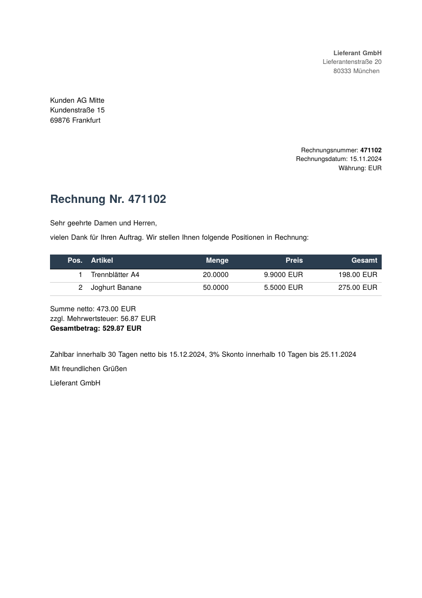

# ZUGFeRD-Rechnung im Markdown-Modus

Erstellt eine **EN 16931 / ZUGFeRD 2 / Factur-X**-konforme Rechnungs-PDF
mit eingebetteter Cross-Industry-Invoice-XML. Demonstriert das
**Companion-Lua-Pattern** für Compliance-Formate: glu's Markdown-Mode
kennt selbst nichts ZUGFeRD-spezifisches — alle Plumbing-Schritte
(XML-Anhang, XMP-Erweiterungsschema, Output-Intent, Daten-Extraktion)
laufen in `rechnung.lua` als regulärer Frontend-Lua-Code.

Dasselbe Pattern lässt sich für **XRechnung**, **PEPPOL**, **DIN 5008**
oder beliebige andere Compliance-Formate adaptieren — ohne Änderungen am
glu-Core.

## Dateien

| Datei | Zweck |
|---|---|
| `rechnung.md` | Sichtbare Rechnung in Markdown; setzt `format: PDF/A-3b` per Frontmatter, nutzt `{= zugferd.* =}` Inline-Expressions |
| `rechnung.lua` | Companion-Lua: parst XML, exponiert `zugferd`-Global, registriert `page_init`-Callback für Output-Intent + Anhang + XMP-Extension |
| `rechnung.css` | Layout-Stylesheet (Briefkopf, Adressblock, Tabelle, Summen) |
| `invoice.xml` | ZUGFeRD 2.3.0 Cross-Industry-Invoice (FeRD-Beispiel) |
| `AdobeRGB1998.icc` | Output-Intent für PDF/A-3 |
| `Readme.md` | Diese Beschreibung |
| `result.pdf`, `firstpage.png` | Statische Snapshot-Artefakte |

## Lauf

```
glu rechnung.md
```

Output: `rechnung.pdf` neben dem Skript. Verifikation des
ZUGFeRD-Anhangs:

```
pdfdetach -list rechnung.pdf
# 1 embedded files
# 1: factur-x.xml

exiftool -XMP-pdfaid:Part -XMP-zf:ConformanceLevel \
         -XMP-zf:DocumentFileName rechnung.pdf
# Part                : 3
# Conformance Level   : EN 16931
# Document File Name  : factur-x.xml
```

## Wie das Pattern funktioniert

glu lädt automatisch die zum Markdown-Stem passende Lua-Datei
(`rechnung.lua` für `rechnung.md`). Diese läuft als Top-Level-Skript
*bevor* `{= … =}` Inline-Expressions oder `{lua}`-Blöcke im Markdown
ausgewertet werden — perfekt für Daten-Vorbereitung.

**Drei Bausteine:**

1. **XML-Parsing** (Top-Level in `rechnung.lua`): `cxpath` öffnet
   `invoice.xml`, extrahiert die Felder, setzt das `zugferd`-Global mit
   `id`, `date`, `currency`, `seller.*`, `buyer.*`, `lines[i].*`,
   `total`, `tax_total`, `payment_terms` etc. Alle Werte bleiben
   **Strings** — keine Float-Rundungsfehler, Locale-Formatierung dem
   Anwender überlassen.

2. **Inline-Expressions im Body**: `{= zugferd.id =}`,
   `{= zugferd.buyer.name =}` etc. Die Positions-Tabelle wird in einem
   kleinen `{lua}`-Block aus `zugferd.lines` zusammengebaut und als
   Markdown-Pipe-Table zurückgegeben.

3. **PDF-Compliance-Plumbing** (`page_init`-Callback): beim ersten
   Page-Init ist das `frontend.Document` verfügbar und wir können
   `load_colorprofile` + `attach_file` + `add_xmp_extension` rufen.
   Eine `initialized`-Guard sorgt dafür, dass das nur einmal passiert.
   `format: PDF/A-3b` wird via Markdown-Frontmatter gesetzt (das ist
   ein generischer glu-Key, kein ZUGFeRD-Spezifikum).

## Warum Companion-Lua statt eingebaut?

`★ Insight ─────────────────────────────────────`
- ZUGFeRD ist eine **Domain-spezifische** Compliance-Anforderung
  (Rechnungen mit eingebetteter strukturierter XML + Schema-Validierung).
  glu ist ein **horizontales Typesetting-Tool**. Würde glu ZUGFeRD im
  Core unterstützen, wäre der nächste PR „XRechnung", dann „PEPPOL",
  dann „BSI TR-RESISCAN" — die Liste hat kein natürliches Ende.
- Companion-Lua ist glu's etablierter Erweiterungsmechanismus. Es ist
  versionsfest, testbar, von Hand zu inspizieren, und der Anwender hat
  volle Kontrolle. Wenn morgen die ZUGFeRD-Spec eine neue Property
  einführt, passt der Anwender 5 Zeilen `rechnung.lua` an — keine
  glu-Release nötig.
- Falls sich später eine Plugin-Architektur als sinnvoll erweist (wenn
  3-5 verschiedene Companion-Lua-Setups für ähnliche Aufgaben in der
  Praxis entstehen), ist Companion-Lua die Proto-Phase, aus der die
  Plugin-API natürlich abgeleitet werden kann.
`─────────────────────────────────────────────────`

## Anpassung für Ihre Rechnung

1. `invoice.xml` durch Ihre CII-XML ersetzen (oder per Skript erzeugen)
2. `rechnung.md` an Ihr Layout anpassen
3. `rechnung.lua` ändert sich **nicht** — die XPath-Mappings decken alle
   EN-16931-Pflichtfelder ab
4. `AdobeRGB1998.icc` durch ein sRGB- oder anderes ICC-Profil ersetzen,
   falls Ihr Workflow das verlangt

## Result


