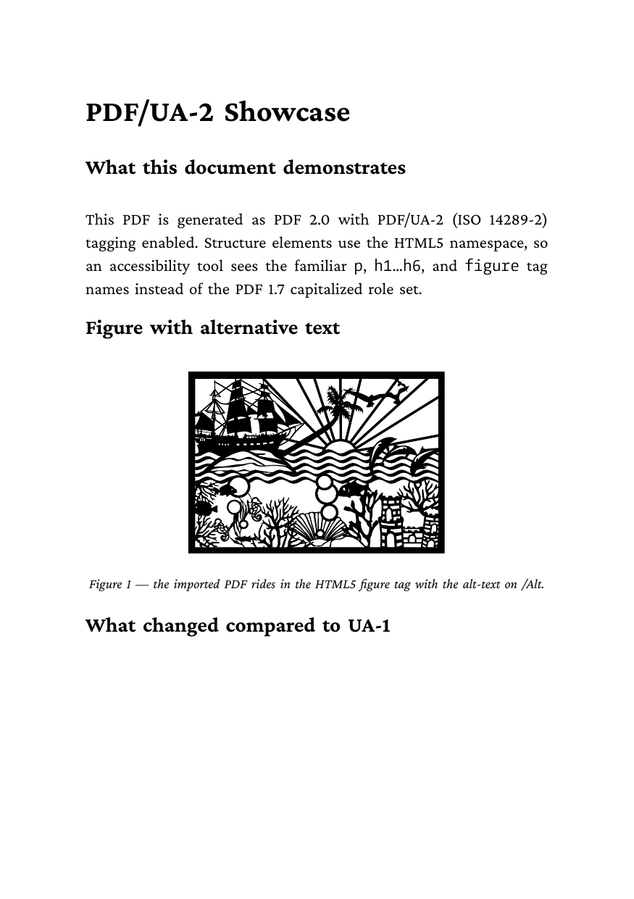

# 11 — PDF/UA-2 accessibility

ISO 14289-2 / PDF 2.0 showcase. Same source structure as `10-pdfua` but
with two flips:

* `bg:format="PDF/UA-2"` on `fo:root`
* implicit upgrade to PDF 2.0 header + HTML5-namespaced structure tree

| Source | Effect |
|---|---|
| `xml:lang="en-US"` | PDF `/Lang` catalog entry, hyphenation default |
| `bg:format="PDF/UA-2"` | PDF 2.0 header, MarkInfo, StructTreeRoot with `/Namespaces` array (HTML5 + PDF 2.0 SSN), HTML5-namespaced element tree, XMP `pdfuaid:part 2` |
| `<fo:title>…</fo:title>` | PDF `/Title` (and XMP `dc:title`) |

What you get in the output:

* `%PDF-2.0` header, no `/Info` dictionary (deprecated in 2.0; XMP carries the metadata)
* `/MarkInfo << /Marked true >>` (typed Boolean, `/Suspects` dropped: default `false`)
* StructTreeRoot `/Namespaces` array referencing two `/Namespace` objects:
  * `http://www.w3.org/1999/xhtml` (HTML5)
  * `http://iso.org/pdf2/ssn` (PDF 2.0 Standard Structure Namespace)
* Structure elements:
  * `/S /Document` with `/NS` → PDF 2.0 SSN (no HTML5 root-element role)
  * `/S /h1`…`/S /h6`, `/S /p`, `/S /figure`, `/S /table`, etc. with `/NS` → HTML5
* XMP `<pdfuaid:part>2</pdfuaid:part>`

## Run

```
glu ../foproc.lua 11-pdfua2.fo out=result.pdf
```

## Verifying

```
pdfinfo result.pdf                     # PDF version: 2.0, Tagged: yes
veraPDF --profile PDF/UA-2 result.pdf  # full ISO 14289-2 conformance
```

## Result


