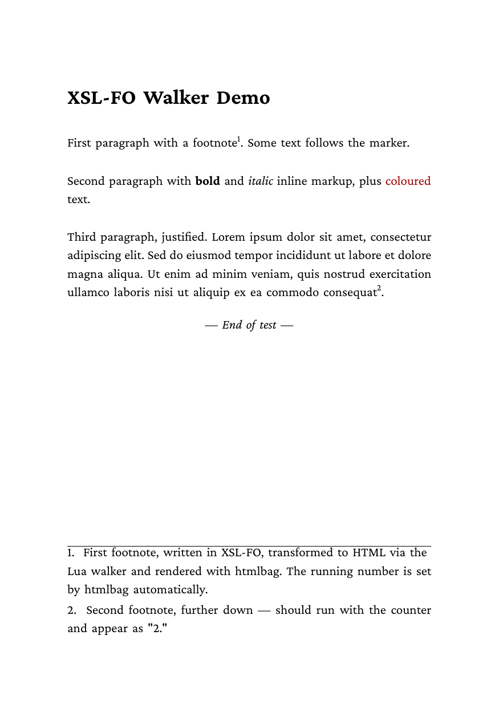
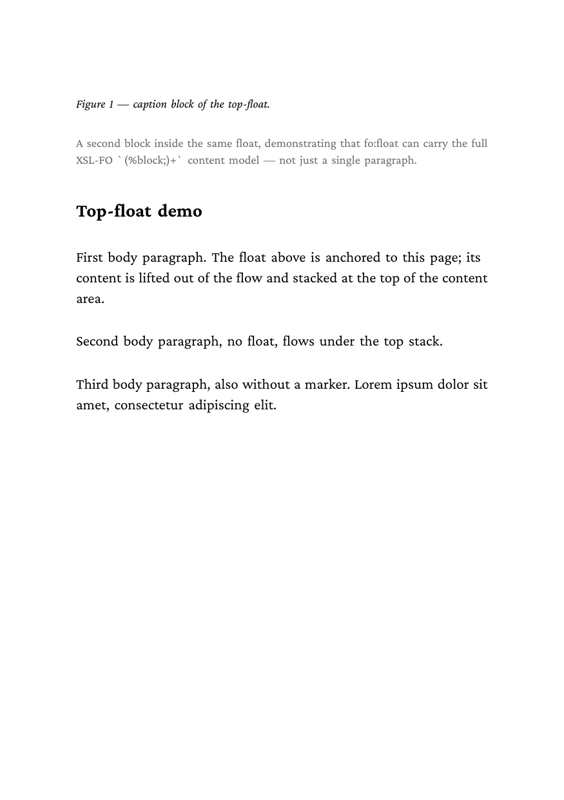
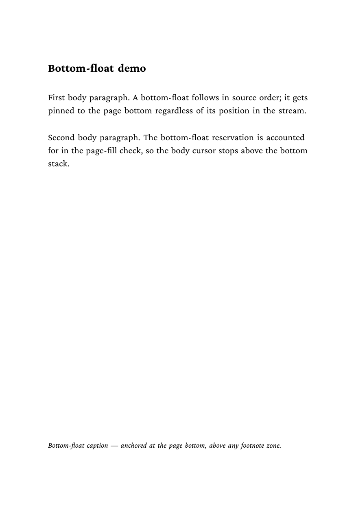
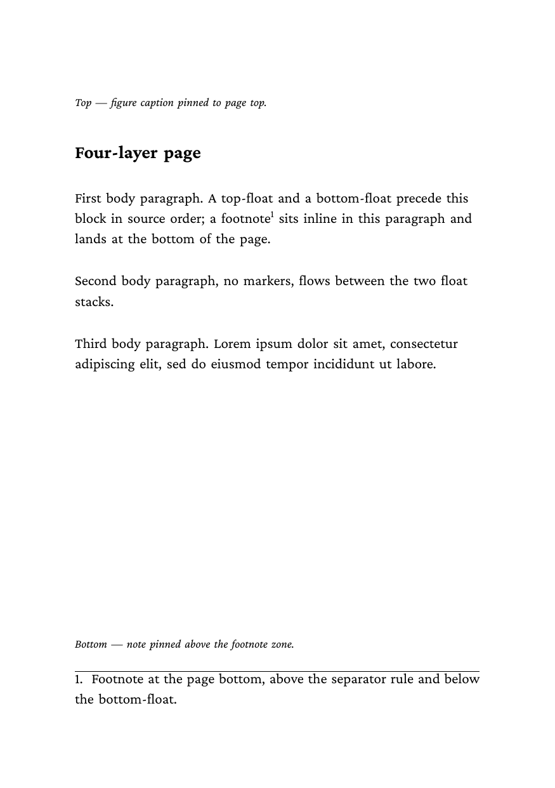
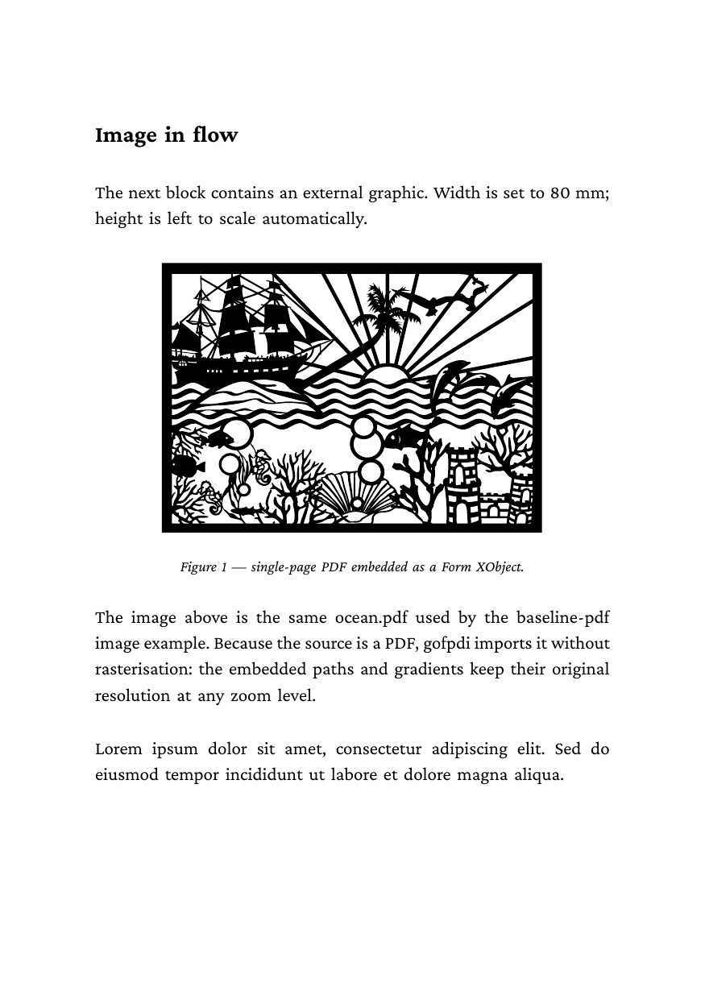
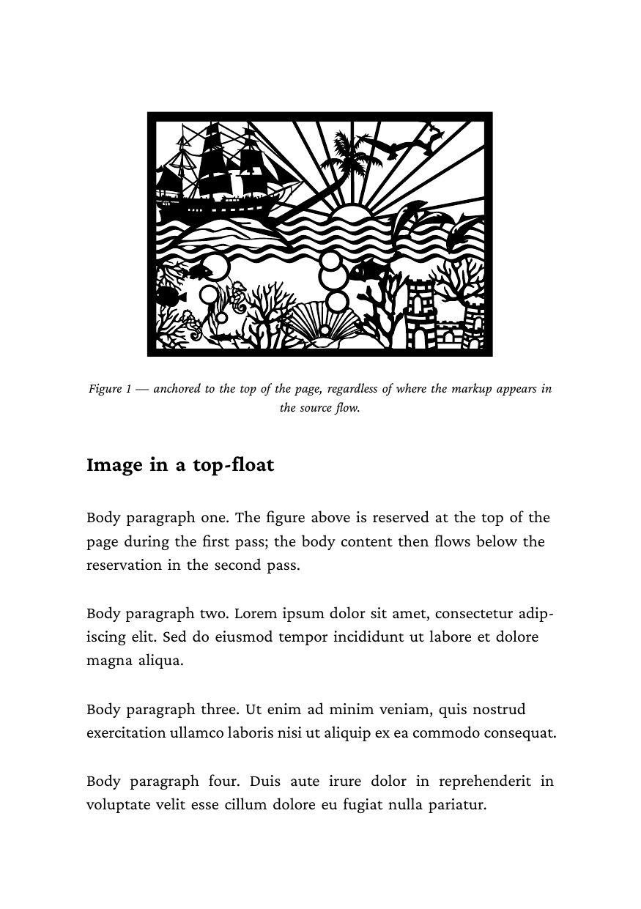
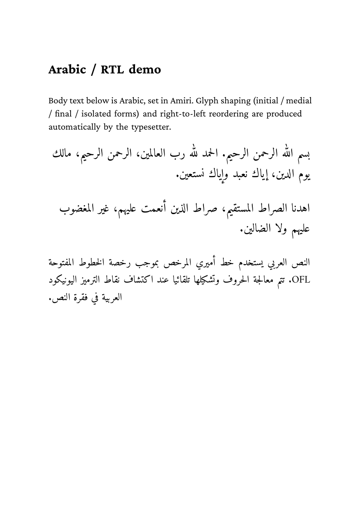
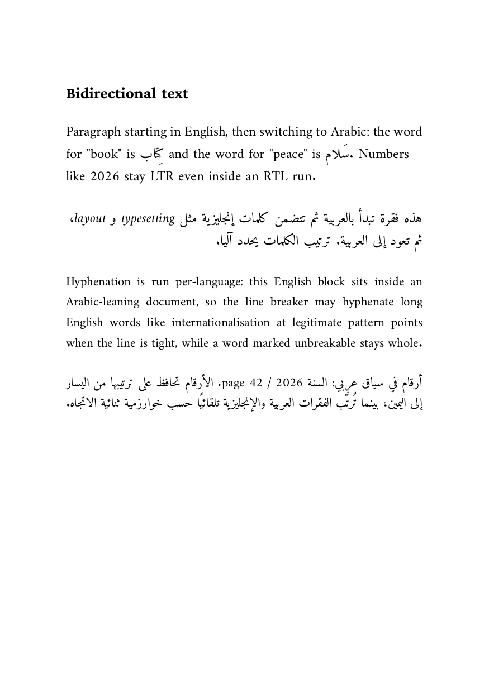
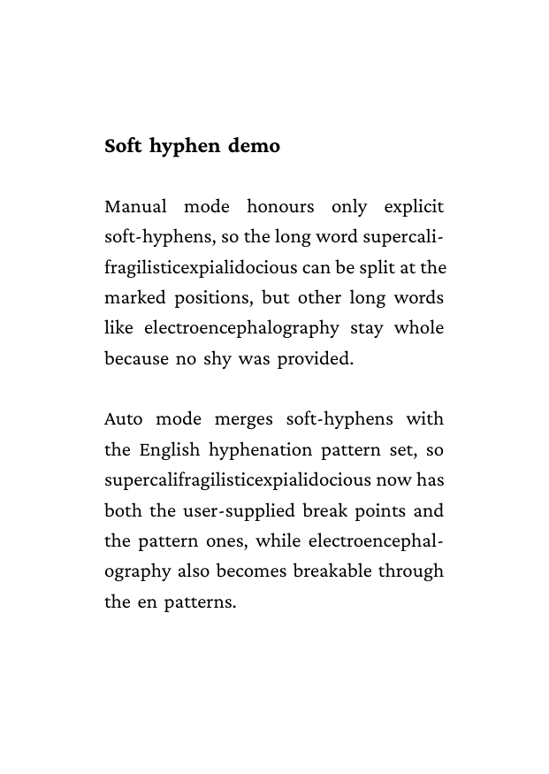
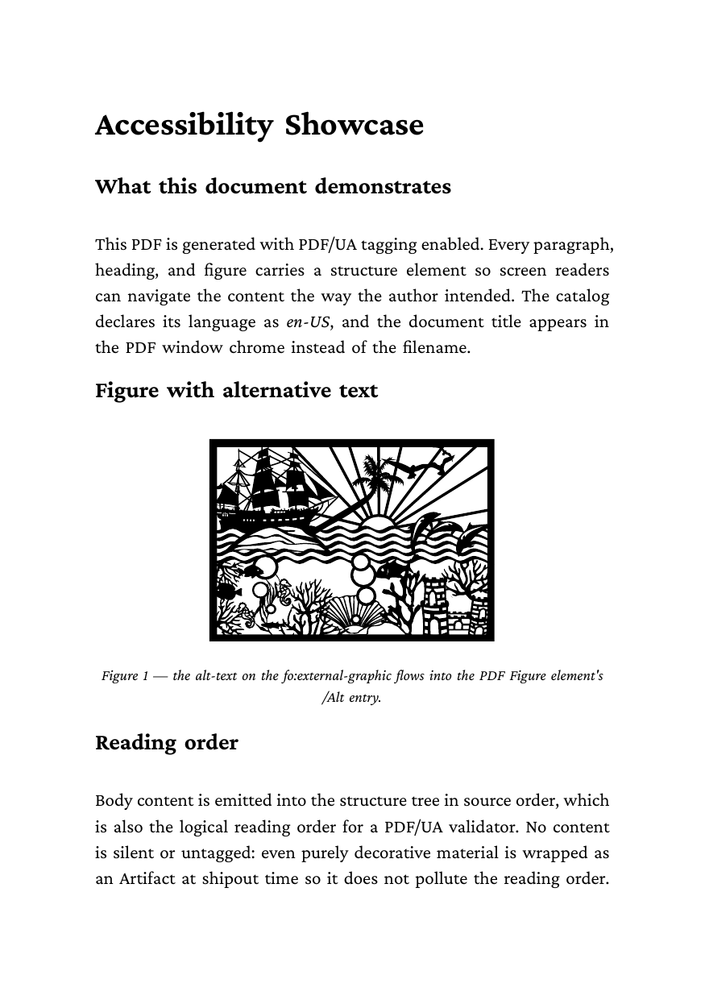

# XSL-FO examples

Ten XSL-FO inputs and the Lua walker that turns them into HTML for
htmlbag to render. The walker is a proof-of-concept, not a full XSL-FO
processor — it covers the most common formatting objects and
degrades gracefully on the rest.

Each example lives in its own subdirectory with a `result.pdf` and a
`firstpage.png` next to the source `.fo`. Shared assets
(`foproc.lua`, `ocean.pdf`, `amiri-*.ttf`) live at this level.

## Examples

Description | Preview
--- | ---
[01 — Basic walker](01-basic) — page master, blocks, inline markup, footnotes | <a href="01-basic"></a>
[02 — Top float](02-float-top) — `fo:float[float="before"]` with multi-block content | <a href="02-float-top"></a>
[03 — Bottom float](03-float-bottom) — `fo:float[float="after"]` above the footnote zone | <a href="03-float-bottom"></a>
[04 — All four insert classes](04-float-mixed) — top-float + body + bottom-float + footnote on one page | <a href="04-float-mixed"></a>
[05 — Image in flow](05-image) — `fo:external-graphic` referencing a PDF, embedded as a Form XObject | <a href="05-image"></a>
[06 — Image in a top float](06-image-float) — figure-at-top-of-page pattern | <a href="06-image-float"></a>
[07 — Arabic / RTL](07-rtl-arabic) — Amiri via `bg:font-face`, automatic shaping & bidi | <a href="07-rtl-arabic"></a>
[08 — Mixed LTR / RTL](08-mixed-ltr-rtl) — per-run `xml:lang`, per-language hyphenation | <a href="08-mixed-ltr-rtl"></a>
[09 — Soft hyphens](09-soft-hyphen) — CSS Text 3 `hyphens` modes (`auto` / `manual` / `none`) | <a href="09-soft-hyphen"></a>
[10 — PDF/UA accessibility](10-pdfua) — ISO 14289-1 tagged PDF, headings, alt-text, `/Title`, `/Lang` | <a href="10-pdfua"></a>

## Workflow

A single `glu` invocation walks the FO, builds HTML in memory, and
hands it to glu's HTML pipeline:

```bash
glu ../foproc.lua 01-basic.fo out=result.pdf
```

(run from inside the example subdirectory; `out=result.pdf` writes
the canonical filename used by the screenshot. Without it, the
walker writes `01-basic.pdf`.)

The intermediate HTML is built in memory; no `.html` file is left on
disk. To inspect or debug the generated HTML, append the `keep-html`
keyword:

```bash
glu ../foproc.lua 01-basic.fo keep-html out=result.pdf
```

(The marker is a positional keyword rather than a `--flag` because
glu reserves `--html` for its own debug-output flag and swallows it
before the script sees it.)

## Bundled assets

| File | Source / licence |
|---|---|
| `foproc.lua` | The XSL-FO → HTML walker (proof-of-concept). |
| `ocean.pdf` | Same image used by `baseline/image/`. |
| `amiri-regular.ttf` | Amiri Regular (SIL Open Font Licence 1.1, see `amiri.license`). |
| `amiri-slanted.ttf` | Amiri Slanted — used as the italic variant of the Amiri family. |
| `glu-xslfo.xpr` | Oxygen XML project descriptor (don't edit by hand). |

## What's covered

| XSL-FO feature | Mapping |
|---|---|
| `fo:simple-page-master` | `@page { size, margin }` |
| `fo:flow` | `<body>` |
| `fo:block` | `<p style="...">` |
| `fo:block role="H1..H6"` | `<h1>..<h6>` |
| `fo:inline` | `<span style="...">` |
| `fo:footnote` / `fo:footnote-body` | `<fn>...</fn>` |
| `fo:float[@float="before"]` | `<div style="float: top">` |
| `fo:float[@float="after"]` | `<div style="float: bottom">` |
| `fo:external-graphic` | `` |
| `fo:external-graphic alt="…"` | `` (Figure `/Alt` for PDF/UA) |
| `fo:declarations/bg:font-face` | `@font-face { font-family; src; font-weight; font-style }` |
| `xml:lang="en"` | `lang="en"` |
| `language="en" country="US"` | `lang="en-US"` (BCP47 composite) |
| `hyphenate="true|false|manual"` | `hyphens: auto | none | manual` |
| `xml:lang` on `fo:root` | htmlbag `opts.lang` (PDF `/Lang`) |
| `bg:format="PDF/UA"` on `fo:root` | htmlbag `opts.format` (enables tagging) |
| `fo:title` (child of `fo:root`) | htmlbag `opts.title` (PDF `/Title`) |

Compound properties (e.g. `space-before.optimum`) are not unpacked;
the walker translates the simple property name to the closest CSS
equivalent.

`bg:font-face` lives in our own extension namespace
`https://boxesandglue.dev/ns/xslfo`, declared on `fo:root` as
`xmlns:bg="…"`. XSL-FO 1.1 §6.4.2 explicitly allows elements from any
other namespace inside `fo:declarations`, which is why this passes
schema validation in oxygen XML and similar tools (where
`fo:font-face` would not — it is not on the spec's element list). The
shape mirrors CSS `@font-face` so the walker can pass it through
verbatim.

## Right-to-left text

htmlbag does not honour `dir="rtl"` or CSS `direction`. RTL is enabled
automatically when boxesandglue's paragraph builder sees Arabic /
Hebrew codepoints — bidi reordering and Arabic shaping run as a side
effect of running the line breaker on the content. The .fo files in
07/08 therefore just embed UTF-8 Arabic; no extra direction property
is required.

## Per-run hyphenation

The walker maps `xml:lang` (and the `language`+`country` pair) to
HTML `lang=`. htmlbag resolves the tag to a TeX hyphenation pattern
set and hands it to the typesetter as a per-run language switch. Tags
without a TeX pattern (Arabic, Hebrew, CJK, …) resolve to a no-op
hyphenator, matching CSS Text 3 §6 — a UA must not hyphenate without
matching patterns.

The `hyphenate` FO property maps to CSS `hyphens`:

* `hyphenate="true"`   → `hyphens: auto`   — automatic + soft-hyphens
* `hyphenate="false"`  → `hyphens: none`   — never break
* `hyphenate="manual"` → `hyphens: manual` — only `&#xAD;` (U+00AD)

A soft-hyphen embedded in the text (`&#xAD;`) is preserved end-to-end
and produces a discretionary break point at that position whenever
`hyphens` is not `none`. Example 09 demonstrates the three modes side
by side.

## PDF/UA tagging

Set `bg:format="PDF/UA"` on `fo:root` to opt the document into the
tagged-PDF pipeline. The walker reads three top-level metadata items:

| Source | Effect |
|---|---|
| `xml:lang` on `fo:root` | PDF `/Lang` catalog entry, document-wide hyphenation default |
| `bg:format="PDF/UA"` on `fo:root` | Enables `MarkInfo /Marked true`, `StructTreeRoot`, `/DisplayDocTitle`, XMP `pdfuaid:part 1`, per-element role mapping |
| `<fo:title>` (child of `fo:root`) | PDF `/Title` (also XMP `dc:title`) |

Inside the flow:

| Source | Structure element |
|---|---|
| `<fo:block role="H1">` … `role="H6"` | `H1` … `H6` |
| `<fo:block>` | `P` |
| `<fo:external-graphic alt="…">` | `Figure` with `/Alt` entry |
| `<fo:inline>` | `Span` |

Verify with `pdfinfo` (Title, Tagged: yes, Lang) and
`veraPDF --profile PDF/UA-1` for full ISO 14289-1 conformance.
Example 10 covers all of the above.

## What's not covered

The walker deliberately ignores anything that the underlying htmlbag
layout engine doesn't support: side floats (`float="start"|"end"|
"inside"|"outside"`), `fo:marker` / `fo:retrieve-marker` (running
content), `fo:repeatable-page-master-alternatives` (left/right page
asymmetry), `fo:page-number-citation`, multi-column regions. Inputs
using these elements will pass through partially or be silently
dropped.

For the htmlbag-side documentation of what's supported, see the
[htmlbag handbook section](https://doc.speedata.de/htmlbag/) (or the
local `boxesandglue-website/content/htmlbag/` source).
